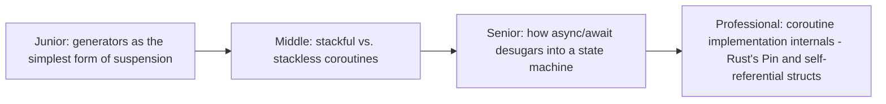

# Coroutines & Generators

> A function that can pause mid-execution and resume later, preserving its
> local state exactly where it left off — the language-level machinery
> that makes `async`/`await` possible at all. This page covers what's
> actually happening under the hood when a function "suspends."

## Choose a level

| Level | Guide | You are done when |
|---|---|---|
| Junior | [Generators as simple suspension](junior.md) | You can trace a Python generator's `yield` pausing and resuming with preserved local state. |
| Middle | [Stackful vs. stackless](middle.md) | You can explain the difference between a coroutine with its own full stack and one without. |
| Senior | [How async/await desugars](senior.md) | You can explain how a compiler transforms `async fn` into a state machine. |
| Professional | [Rust's Pin and self-referential structs](professional.md) | You can explain why async Rust specifically needs `Pin` to handle self-referential generated state machines safely. |

## Practice rule

Before assuming `async`/`await` is a runtime-only feature, remember it's
also a **compile-time transformation** — the compiler rewrites your
function into a state machine object; understanding this transformation
demystifies most "why does this async code behave unexpectedly" puzzles.

## Related

- [Async/Await Syntax](../05-async-await-syntax/README.md)
- [Async/Await (Concurrency Model Overview)](../../concurrency/04-async-await/README.md)
