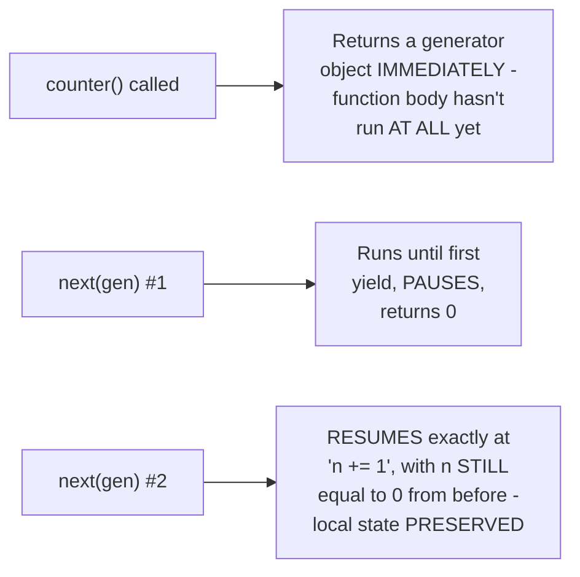

# Coroutines & Generators — Junior

<!-- level-focus -->
At junior level, focus on this question:

> How does a Python generator's `yield` pause execution and preserve local
> state exactly where it left off?

---

## A generator, traced step by step

```python
def counter():
    print("starting")
    n = 0
    while True:
        yield n           # PAUSE here, hand back n
        n += 1            # RESUME here next time

gen = counter()
print(next(gen))  # prints "starting", then yields 0
print(next(gen))  # RESUMES right after yield, n becomes 1, yields 1
print(next(gen))  # RESUMES again, n becomes 2, yields 2
```



Calling `counter()` doesn't execute the function body at all — it returns
a **generator object** that, when `next()` is called, runs the function
body until the next `yield`, then **pauses**, preserving every local
variable's current value exactly. The next `next()` call resumes
**exactly** at that paused point, with `n` still holding its previous
value — this preservation of local state across a pause is the
fundamental capability every coroutine/async function is built on.

> 🎓 **Takeaway:** a generator's `yield` is the simplest possible
> demonstration of "pause a function, preserve its state, resume later" —
> `async`/`await` is, at its core, this exact same capability, just with
> additional machinery (an event loop scheduling when to resume, based on
> I/O readiness rather than explicit `next()` calls).

## Test yourself

1. Why doesn't calling `counter()` immediately print "starting"?
2. Why does `n` retain its value (0, then 1, then 2) across separate
   `next()` calls, rather than resetting each time?
3. Why is a generator's `yield`/resume mechanism described as "the
   fundamental capability" underlying async/await?

Continue to [`middle.md`](middle.md).
