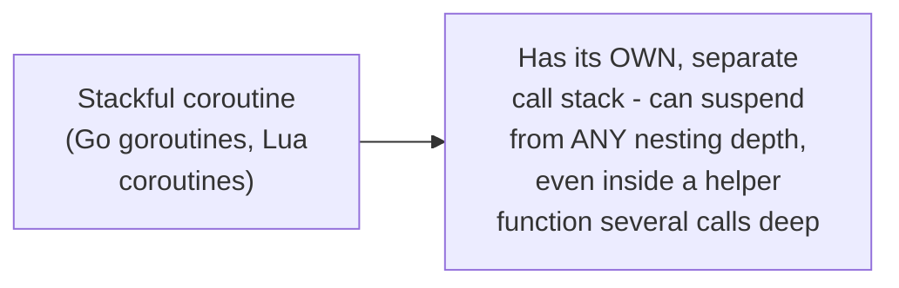
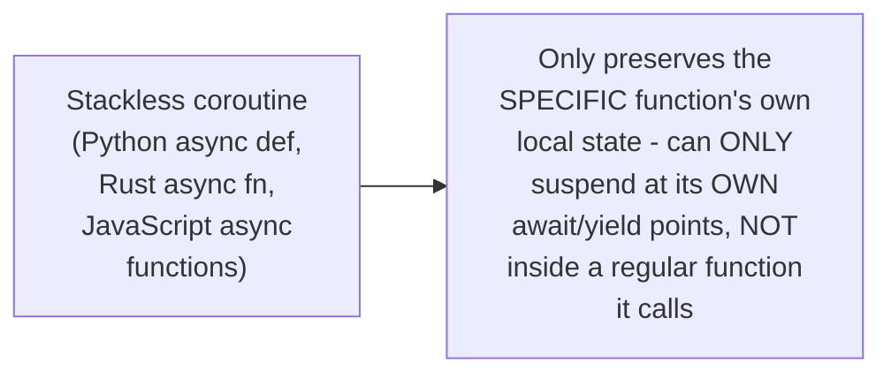

# Coroutines & Generators — Middle

<!-- level-focus -->
At middle level, focus on this question:

> What's the difference between a stackful and a stackless coroutine?

Prerequisite: [`junior.md`](junior.md).

---

## Stackful: a coroutine with its own full call stack

A **stackful** coroutine has its own dedicated stack, meaning it can
suspend from **anywhere** in its call graph — including deep inside a
helper function several levels of function calls down — because the
entire call stack (every frame) is preserved when it pauses, not just the
top-level function's local variables. Go's goroutines are the most
widely-used example: any function, at any call depth, can trigger a
goroutine's suspension (via a blocking channel operation) without any
special "this function is suspendable" annotation.

## Stackless: only the specific function's state machine is preserved

A **stackless** coroutine (Python's `async def`, Rust's `async fn`,
JavaScript's async functions) preserves only its own local state as a
compiler-generated state machine (per `senior.md`) — it can only suspend
at its own explicit `await`/`yield` points, meaning a **regular**,
non-async function it calls cannot itself suspend the coroutine; only
another `async`/`await`-marked function can, and that marking must
propagate all the way up the call chain ("function coloring," per the
Async Programming README's cross-language comparison).

| | Stackful | Stackless |
|---|---|---|
| Memory per coroutine | Larger (needs its own stack, though often growable/segmented, like goroutines) | Smaller (just the state machine's captured variables) |
| Where it can suspend | Anywhere in its call graph | Only at its own explicit await points |
| Function coloring | Not needed (any function can suspend transparently) | Required (async functions are a distinct, marked category) |

> 🎓 **Takeaway:** Go's choice of stackful goroutines is precisely why Go
> has no `async`/`await` keyword and no function coloring at all — any
> function can block/suspend transparently. Python/Rust/JavaScript's
> stackless model is more memory-efficient per-task but requires the
> `async`/`await` syntax and function-coloring discipline this whole
> track covers in depth.

## Test yourself

1. Why can a Go goroutine suspend from inside a regular helper function
   several calls deep, while a Python `async def` coroutine cannot?
2. Why does stackless coroutine design require "function coloring"
   (marking functions as `async`) while stackful design doesn't?
3. Why might stackless coroutines use less memory per coroutine than
   stackful ones, in general?

Continue to [`senior.md`](senior.md).
