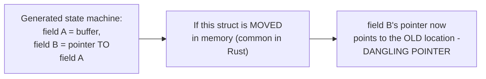
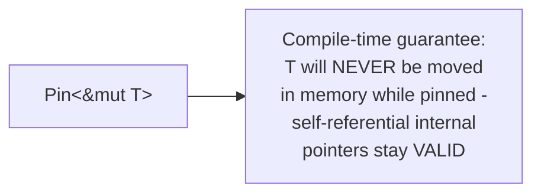

# Coroutines & Generators — Professional

<!-- level-focus -->
At professional level, focus on this question:

> Why does async Rust specifically need `Pin` to safely handle
> self-referential generated state machines, when other languages don't
> expose this problem to users at all?

Prerequisite: [`senior.md`](senior.md).

---

## The self-referential state machine problem

`senior.md`'s generated state machine can end up **self-referential** — a
local variable captured as a state-machine field, with another field
holding a **reference/pointer** to that first field (a common pattern:
borrowing a local buffer while also awaiting on something else that needs
that borrow). If this state-machine struct is ever **moved** in memory
(Rust values can be moved by default — assigned, returned, stored in a
container), the internal pointer would now point to the **old** memory
location, not the moved struct's new location — a dangling pointer, a
serious memory-safety bug.



## Why other languages don't expose this problem

Python, JavaScript, and most garbage-collected languages allocate their
coroutine/generator state on the **heap** and never move it after
allocation (the garbage collector may relocate objects in some GC
implementations, but it transparently updates all references when it
does) — the self-referential-pointer-invalidated-by-a-move problem simply
doesn't arise because the runtime handles all the pointer-fixing
automatically, invisibly to the programmer. Rust's async design
deliberately avoids requiring a garbage collector (a core language design
goal, per its zero-cost-abstractions philosophy), which means it cannot
rely on a GC to transparently fix up moved self-referential pointers —
the problem becomes the programmer's (and the type system's) concern
instead.

## `Pin`: a type-system guarantee against moving

```rust
fn poll_future(future: Pin<&mut MyFuture>, cx: &mut Context) -> Poll<Output> {
    // Pin<&mut T> is a COMPILE-TIME guarantee: this value will NEVER
    // be moved in memory for as long as this Pin exists - self-
    // referential pointers inside it remain valid
}
```



`Pin` is Rust's type-system-level solution: a `Pin<&mut T>` is a
guarantee, enforced by the compiler, that the pointed-to value will never
be moved for the lifetime of that `Pin` — this lets async Rust's
generated self-referential state machines exist safely, with the
compiler (not a garbage collector, and not the programmer manually)
verifying the no-move guarantee at compile time.

> 🎯 **Professional-level insight:** `Pin`'s existence is a direct,
> specific consequence of Rust's choice to implement `async`/`await`
> without a garbage collector — this is exactly the kind of language-
> design trade-off referenced in the Async Programming README's
> cross-language comparison ("Rust made async zero-cost but pays for it
> in compile-time complexity"). Understanding *why* `Pin` exists (not
> just how to use it) requires understanding both `senior.md`'s state-
> machine generation and this page's self-reference/move-safety problem
> together — `Pin` is the price of zero-cost, GC-free async coroutines.

## Further Reading

- Rust async book — "Pinning" (the official, detailed explanation of
  `Pin`'s purpose and the self-referential state machine problem).
- Withoutboats (Rust async working group) — blog series on async Rust's
  design history and the motivations behind `Pin`.
- See also: [Async Programming README](../README.md) (the cross-language
  comparison this page's insight draws on).
