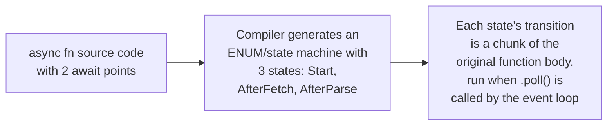

# Coroutines & Generators — Senior

<!-- level-focus -->
At senior level, focus on this question:

> How does a compiler actually transform an `async fn` into a state
> machine, mechanically?

Prerequisite: [`middle.md`](middle.md).

---

## The transformation, conceptually

```rust
async fn fetch_and_process(url: &str) -> Result<Data, Error> {
    let response = fetch(url).await;   // suspend point 1
    let parsed = parse(response).await; // suspend point 2
    Ok(parsed)
}
```



The compiler generates something conceptually equivalent to:

```rust
enum FetchAndProcessState {
    Start { url: String },
    AfterFetch { fetch_future: FetchFuture },
    AfterParse { parse_future: ParseFuture },
    Done,
}
// Each call to .poll() on this state machine runs the code between
// the CURRENT state and the NEXT await point, then transitions state
```

Every `await` point becomes a **state boundary** — the local variables
alive at that point (needed after resuming) are captured as fields of
the generated state-machine type, and the event loop drives progress by
repeatedly calling `.poll()` on this object, which runs the code segment
between the current state and the next await point, then transitions.

> 🎯 **Senior takeaway:** an `async fn` isn't magic — it's a
> compile-time source-to-source-like transformation into an explicit
> state machine (an enum/struct capturing exactly the variables that need
> to survive across a suspension point), driven by repeated `.poll()`
> calls from the event loop. This transformation is precisely why local
> variables spanning an `await` point have real memory cost (they're
> captured as state-machine fields) and why understanding this mechanism
> demystifies otherwise-confusing async stack traces and compiler errors
> about lifetimes/borrowing across await points (particularly severe in
> Rust, covered next).

## Test yourself

1. Why does each `await` point become a distinct state in the generated
   state machine?
2. Why do local variables that need to survive across an `await` point
   have a real memory cost, in terms of this transformation?
3. Why does the event loop only need to call `.poll()` repeatedly, rather
   than understanding anything about the function's original source-level
   logic?

Continue to [`professional.md`](professional.md) to see why Rust
specifically needs `Pin` to handle these generated state machines safely.
