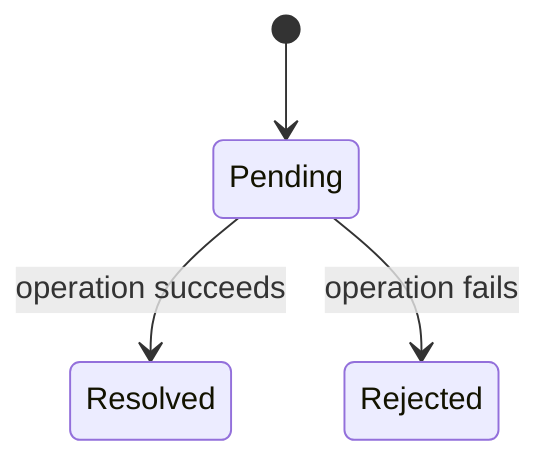

# Futures, Promises, Tasks — Junior

<!-- level-focus -->
At junior level, focus on this question:

> What does a future/promise actually represent, and what are its three
> possible states?

---

## A placeholder for a value that doesn't exist yet

```javascript
const promise = fetch("https://api.example.com/data");
// `promise` is NOT the actual response data - it's a PLACEHOLDER
// representing "the response, whenever it arrives"
```



A future/promise has exactly three possible states: **pending** (the
value isn't ready yet), **resolved**/fulfilled (the value is now
available), or **rejected** (an error occurred instead of a value). Code
that wants the eventual value attaches a callback (`.then()` in
JavaScript, `await` in most languages) to be notified/resumed once the
future transitions out of pending.

> 🎓 **Takeaway:** a future/promise is fundamentally just a container with
> these three states, plus a mechanism for other code to be notified when
> it transitions — everything else covered in this topic (eager/lazy
> execution, tasks) builds on top of this basic three-state container
> concept.

## Test yourself

1. Why is a promise/future not the same thing as the actual value it will
   eventually contain?
2. Once a future transitions to "resolved," can it ever go back to
   "pending" or transition to "rejected"?
3. What mechanism lets code "wait" for a future to resolve without
   blocking a thread (recall the Async/Await concurrency-model page)?

Continue to [`middle.md`](middle.md).
