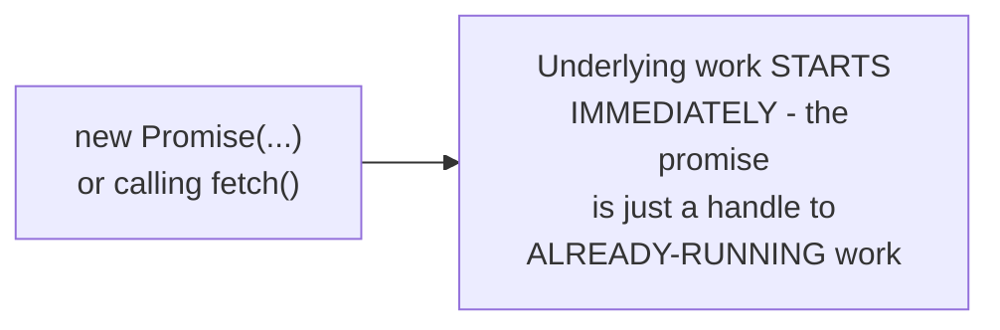
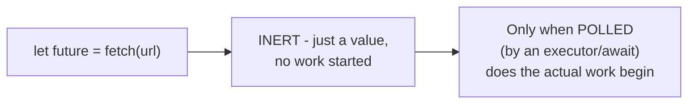

# Futures, Promises, Tasks — Middle

<!-- level-focus -->
At middle level, focus on this question:

> Does creating a future start the underlying work immediately (eager), or
> only once something actively drives it (lazy)?

Prerequisite: [`junior.md`](junior.md).

---

## JavaScript Promises: eager — work starts immediately

```javascript
const promise = fetch(url);   // the actual network request STARTS
                                // RIGHT NOW, even before anyone
                                // calls .then() or awaits it
console.log("This runs while the fetch is already in flight");
```



## Rust Futures: lazy — nothing happens until polled

```rust
let future = fetch(url);  // NOTHING happens yet - this just
                           // constructs the future VALUE
// The actual network request only starts once something
// polls this future (typically via .await inside an async
// context being driven by an executor)
some_async_fn(future).await;  // NOW the work actually begins
```



| | JavaScript Promise | Rust Future |
|---|---|---|
| When does work start | Immediately upon creation | Only when first polled |
| A future you never await | Work still happens (fire-and-forget) | Work NEVER happens at all |

> 🎓 **Takeaway:** this eager-vs-lazy distinction has a real, surprising
> consequence: an unawaited JavaScript promise's work still runs (a
> common "fire and forget" pattern, sometimes accidental); an unawaited/
> unpolled Rust future's work **never runs at all** — dropping a Rust
> future without ever polling it is equivalent to never having called the
> function, a frequent source of confusion for engineers moving between
> these two languages' async models.

## Test yourself

1. Why does an unawaited JavaScript promise's underlying operation still
   execute, while an unawaited Rust future's operation never runs at all?
2. Give a real bug scenario in JavaScript caused by accidentally not
   awaiting a promise (hint: think about error handling and ordering).
3. Give a real bug scenario in Rust caused by constructing a future but
   never polling/awaiting it.

Continue to [`senior.md`](senior.md).
