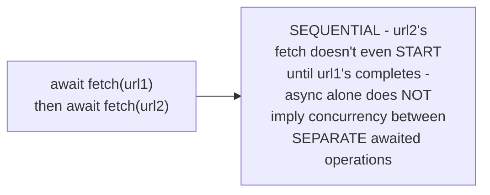
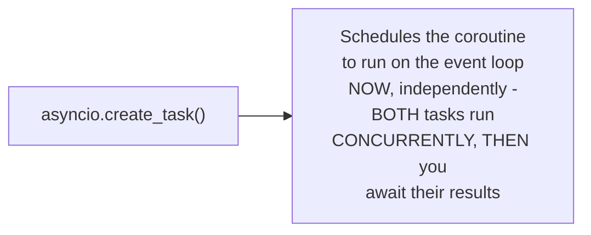

# Futures, Promises, Tasks — Senior

<!-- level-focus -->
At senior level, focus on this question:

> What does a "Task" add on top of a plain future/coroutine, and why is
> that addition necessary for actual concurrent execution?

Prerequisite: [`middle.md`](middle.md).

---

## A bare future/coroutine, awaited directly, doesn't run concurrently

```python
async def fetch_two_things():
    result1 = await fetch(url1)  # runs to completion FIRST
    result2 = await fetch(url2)  # THEN starts - SEQUENTIAL,
                                   # not concurrent, despite being async!
```



Simply writing two `await` expressions in sequence, even in async code,
runs them **one after another** — the second doesn't start until the
first fully completes. This is a common, surprising realization: `async`/
`await` by itself gives you non-blocking waiting, not automatic
concurrency between independently awaited operations.

## Task: explicitly schedule a coroutine to run concurrently, NOW

```python
async def fetch_two_things_concurrently():
    task1 = asyncio.create_task(fetch(url1))  # SCHEDULED to run
                                                 # NOW, concurrently
    task2 = asyncio.create_task(fetch(url2))  # ALSO scheduled NOW
    result1 = await task1  # wait for it (it's ALREADY been running)
    result2 = await task2  # this one's ALSO already been running
```



A **Task** wraps a coroutine and explicitly schedules it onto the event
loop **immediately**, independent of when (or whether) you `await` it —
this is what actually achieves concurrency between multiple operations:
without wrapping in a Task, `await`ing two coroutines back-to-back is
sequential; wrapping both in Tasks first, then awaiting them, lets them
run **concurrently**, because both were already scheduled and progressing
before either `await` blocks on their result.

> 🎯 **Senior takeaway:** `async`/`await` alone provides non-blocking
> waiting for **one** operation; a Task is the piece that actually
> schedules concurrent execution of **multiple** operations. This
> distinction — often blurred by "async" as a catch-all term — is exactly
> why a common async programming mistake is writing sequential `await`
> statements and being surprised that no concurrency actually occurred.

## Test yourself

1. Why does `await fetch(url1); await fetch(url2)` run sequentially, not
   concurrently, even inside an async function?
2. Why does wrapping both calls in `asyncio.create_task()` before
   awaiting them achieve real concurrency?
3. Rewrite a sequential pair of `await` calls to run concurrently using
   `asyncio.gather()` (or the equivalent in another language) instead of
   manual `create_task()` calls.

Continue to [`professional.md`](professional.md) to compare these
concepts precisely across JavaScript, Python, and Rust.
