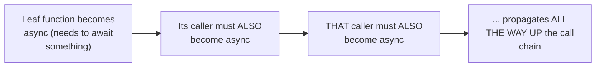

# `async`/`await` Syntax

> "What color is your function?" — the famous framing for why marking a
> function `async` isn't cosmetic: it changes the function's type, forces
> every caller to also become async (or explicitly bridge the gap), and
> this "coloring" propagates through an entire codebase from a single
> leaf-level async call.

## Choose a level

| Level | Guide | You are done when |
|---|---|---|
| Junior | [What changes with async](junior.md) | You can explain what an `async fn`'s return type actually is under the hood. |
| Middle | [Function coloring](middle.md) | You can explain why one async call forces every caller up the chain to also become async. |
| Senior | [Bridging sync and async deliberately](senior.md) | You can design a safe boundary between synchronous and asynchronous code. |
| Professional | [Why Go rejected this trade-off](professional.md) | You can explain Go's alternative (goroutines, no async keyword) and its own trade-offs. |

## Practice rule

Before adding `async` to a low-level utility function "just in case,"
consider that this decision propagates to every single caller,
transitively, for the rest of that function's life in the codebase —
function coloring is a one-way door that's expensive to reverse later.

## Related

- [Coroutines & Generators](../03-coroutines-and-generators/README.md)
- [Mixing Async and Blocking](../10-mixing-async-and-blocking/README.md)
