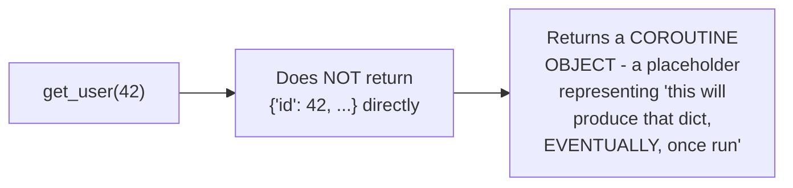

# `async`/`await` Syntax — Junior

<!-- level-focus -->
At junior level, focus on this question:

> What does an `async fn`'s return type actually become, under the hood?

---

## `async fn` returns a future/coroutine object, not the value directly

```python
async def get_user(user_id):
    return {"id": user_id, "name": "Alice"}

result = get_user(42)
print(type(result))  # <class 'coroutine'> - NOT a dict!
print(result)         # <coroutine object get_user at 0x...>
```



Calling an `async def` function doesn't run its body at all yet — it
immediately returns a coroutine object (per the Coroutines & Generators
junior page's generator analogy). You must `await` it (or otherwise drive
it, per Futures/Promises/Tasks) to actually get the underlying value:

```python
async def caller():
    result = await get_user(42)  # NOW actually runs, gets the real dict
    print(result)  # {"id": 42, "name": "Alice"}
```

> 🎓 **Takeaway:** `async` fundamentally changes a function's **type
> signature** — a function that logically returns `dict` actually returns
> "a coroutine/future that will eventually produce a `dict`." This type
> change is exactly why you cannot use an `async fn`'s result directly
> without `await`ing it first, and it's the root cause of `middle.md`'s
> function-coloring propagation.

## Test yourself

1. Why does calling an `async def` function not execute its body
   immediately?
2. What is the actual runtime type of the value returned by calling an
   `async def` function, before it's awaited?
3. What would happen if you tried to use `get_user(42)`'s result directly
   (without `await`) as if it were the dict itself?

Continue to [`middle.md`](middle.md).
