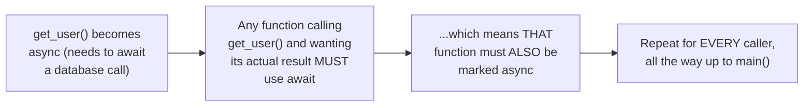

# `async`/`await` Syntax — Middle

<!-- level-focus -->
At middle level, focus on this question:

> Why does making one leaf-level function async force every caller, all
> the way up the call chain, to also become async?

Prerequisite: [`junior.md`](junior.md).

---

## `await` can only be used inside an `async` function

```python
def middle_function():  # NOT async
    result = await get_user(42)  # SYNTAX ERROR:
                                   # 'await' outside async function
```



Because `await` is only legal syntax inside a function marked `async`,
any function that needs to `await` a call to `get_user()` must itself
become `async` — and then **its** callers face the same requirement, and
so on, all the way up to your program's entry point. This is exactly the
"What Color is Your Function?" problem (Bob Nystrom's widely-cited essay,
referenced in this whole tree's Async Programming README) — async and
non-async functions are effectively two different "colors" that can't
freely call each other in the natural direction.

## Why you can't just "call async from sync" normally

```python
def sync_function():
    result = get_user(42)  # this "works" syntactically (no await needed
                             # to just CALL it) but `result` is a
                             # coroutine object, NOT the actual data -
                             # the sync function has no way to properly
                             # DRIVE that coroutine to completion
```

> 🎓 **Takeaway:** function coloring means the decision to make a
> low-level function async is not a local, contained decision — it
> propagates transitively through every calling function that wants that
> function's actual result, which is precisely why "should this utility
> function be async" deserves careful consideration before being decided,
> not treated as a low-stakes implementation detail.

## Test yourself

1. Why is `await` syntactically illegal outside an `async` function?
2. Trace the propagation: if a database driver function becomes async,
   and 5 layers of application code call it transitively, how many of
   those 5 layers must also become async?
3. Why can't a plain synchronous function simply "call" an async
   function and get its real result the normal way?

Continue to [`senior.md`](senior.md).
