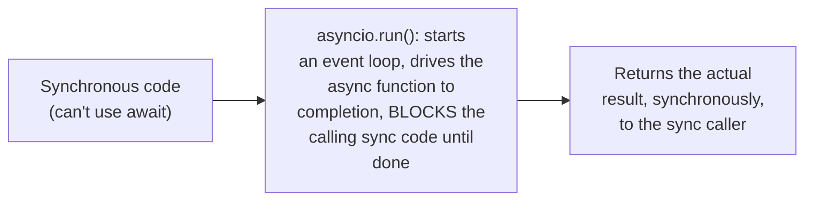
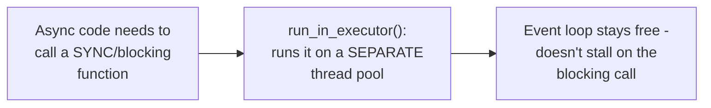

# `async`/`await` Syntax — Senior

<!-- level-focus -->
At senior level, focus on this question:

> How do you deliberately bridge synchronous and asynchronous code at a
> boundary, when the entire codebase can't be converted to async at once?

Prerequisite: [`middle.md`](middle.md).

---

## Running an async function from synchronous code: block and drive it

```python
import asyncio

def sync_entry_point():
    # Deliberately create a NEW event loop, run the async function
    # to completion, and get its result - THIS is the bridge
    result = asyncio.run(get_user(42))
    return result
```



This deliberately **blocks** the synchronous caller until the async
operation completes — you've reintroduced blocking at this specific
boundary, which is fine for a genuine "top of the call stack" entry
point, but dangerous if done repeatedly deep inside an already-running
event loop (nesting event loops, or blocking one loop while driving
another, is a well-documented source of deadlocks and errors in most
async runtimes).

## Running a sync function from async code: offload to a thread/process

```python
async def async_caller():
    loop = asyncio.get_event_loop()
    result = await loop.run_in_executor(None, blocking_sync_function)
    # runs blocking_sync_function on a SEPARATE thread, so it doesn't
    # stall the event loop (per the Event Loop senior page's warning)
```



> 🎯 **Senior takeaway:** the sync-to-async bridge (`asyncio.run` or
> equivalent) and the async-to-sync bridge (`run_in_executor` or
> equivalent) are structurally different, solving different halves of
> `middle.md`'s coloring problem — use the first deliberately, once, at
> a genuine top-level entry point; use the second whenever async code
> must call into unavoidably-synchronous/blocking code, to avoid the
> exact event-loop-stalling bug covered in the Event Loop senior page.

## Test yourself

1. Why is `asyncio.run()` (or equivalent) safe to call once at a program's
   entry point, but risky to call repeatedly nested inside an already-
   running event loop?
2. Why does `run_in_executor` specifically prevent a blocking call from
   stalling the event loop, in a way that calling it directly would not?
3. Design the bridging strategy for a codebase where 90% of code is
   synchronous (legacy) and a new feature needs to call an async-only
   library.

Continue to [`professional.md`](professional.md) to see why Go rejected
this entire trade-off with a different design.
