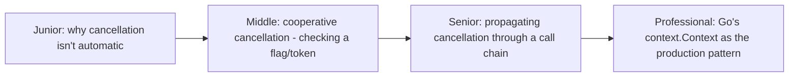
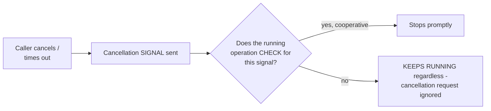

# Cancellation & Timeouts

> Async operations don't stop just because you've stopped caring about
> the result — cancellation must be explicitly requested, and cooperative
> code must explicitly check for it. This page covers cooperative
> cancellation, Go's `context.Context` as the canonical propagation
> mechanism, and structured cancellation's guarantee against orphaned work.

## Choose a level

| Level | Guide | You are done when |
|---|---|---|
| Junior | [Why cancellation isn't automatic](junior.md) | You can explain why simply "giving up on waiting" for a future doesn't stop its underlying work. |
| Middle | [Cooperative cancellation](middle.md) | You can implement a loop that checks a cancellation token periodically. |
| Senior | [Propagating cancellation](senior.md) | You can design cancellation propagation through a multi-level async call chain. |
| Professional | [Go's context.Context](professional.md) | You can explain how context.Context threads cancellation and deadlines through an entire call graph idiomatically. |

## Practice rule

For any long-running async operation, ask: "if the caller times out or
cancels, does this operation actually stop doing work, or does it keep
running to completion in the background regardless?" If you haven't
explicitly wired in cancellation checks, assume the latter.

## Related

- [Structured Concurrency](../08-structured-concurrency/README.md)
- [Circuit Breaker](../../../distributed-system/reliability-patterns/01-circuit-breaker/README.md)
