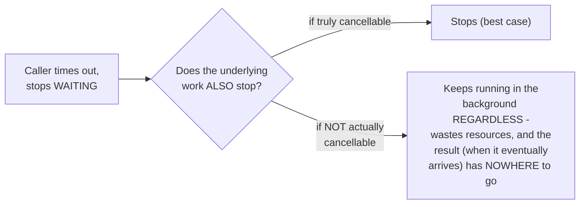

# Cancellation & Timeouts — Junior

<!-- level-focus -->
At junior level, focus on this question:

> Why doesn't simply giving up on waiting for a future actually stop its
> underlying work from continuing?

---

## Timing out on a future doesn't stop what's running

```python
import asyncio

async def slow_operation():
    await asyncio.sleep(10)  # simulates a slow database query
    return "result"

async def caller():
    try:
        result = await asyncio.wait_for(slow_operation(), timeout=2)
    except asyncio.TimeoutError:
        print("Gave up waiting after 2 seconds")
        # But did slow_operation() actually STOP? Depends on the
        # specific implementation - many DO stop it, but the underlying
        # OPERATION (e.g. a real network request already sent) may not
```



Giving up on **waiting** for a result and actually **stopping** the work
that would produce that result are two conceptually distinct things —
many operations (especially ones wrapping external systems, like an
in-flight network request already sent to a server) cannot be truly
"stopped" once started; at best, you can stop **waiting** for their
result and discard it when it eventually arrives.

> 🎓 **Takeaway:** "cancellation" and "giving up on waiting" are not
> automatically the same operation — true cancellation requires the
> underlying work to actively check for and respond to a cancellation
> request (`middle.md`'s cooperative cancellation), and even then, some
> operations (an already-sent network request) may be fundamentally
> uncancellable once started, only discardable once their result arrives
> too late to matter.

## Test yourself

1. Why can a timeout stop your code from *waiting* for a result without
   necessarily stopping the *work* that produces it?
2. Give an example of an operation that's fundamentally difficult or
   impossible to truly cancel once started.
3. What real resource cost does "the work keeps running even though
   nobody's waiting for it anymore" impose?

Continue to [`middle.md`](middle.md).
