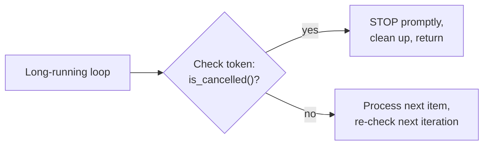
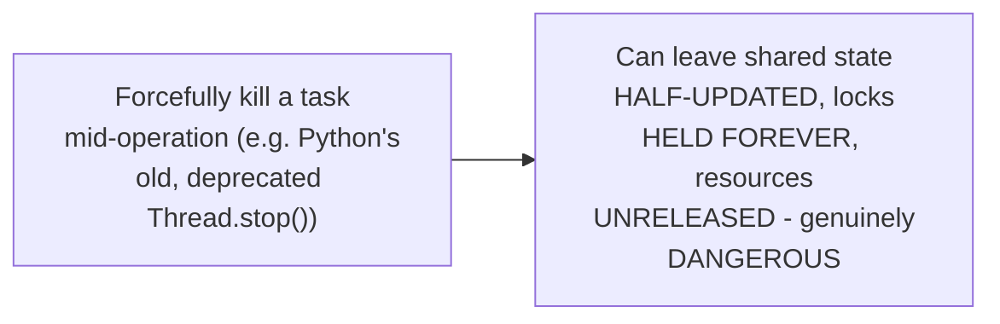

# Cancellation & Timeouts — Middle

<!-- level-focus -->
At middle level, focus on this question:

> How do you implement genuinely cooperative cancellation — a loop that
> actually stops when asked?

Prerequisite: [`junior.md`](junior.md).

---

## A cancellation token, checked periodically

```python
class CancellationToken:
    def __init__(self):
        self._cancelled = False

    def cancel(self):
        self._cancelled = True

    def is_cancelled(self):
        return self._cancelled

async def cancellable_loop(token: CancellationToken):
    for item in large_dataset:
        if token.is_cancelled():
            print("Stopping cooperatively - caller requested cancellation")
            return
        await process(item)
```



This is genuinely **cooperative** — the loop actively checks the token
and voluntarily stops itself when it sees a cancellation request, rather
than being forcibly killed from outside. This is the same voluntary-
resignation pattern from the Leader Election reliability-pattern
professional page's "voluntary resignation" discussion, applied here to
cancellation instead of leadership.

## Why "forceful" cancellation is dangerous and mostly avoided



Most modern async runtimes deliberately **don't** offer a forceful "kill
this task immediately, wherever it currently is" mechanism, precisely
because interrupting a task at an arbitrary point (mid-write to shared
state, holding a lock) can leave the system in a corrupted, inconsistent
state — this is why cooperative cancellation (check a flag/token at safe,
well-defined points) is the standard, safe pattern across virtually every
production async runtime.

> 🎓 **Takeaway:** cancellation in async programming is, by design,
> cooperative — the running code must voluntarily check for and respond
> to a cancellation signal at points where doing so is safe, rather than
> being forcibly interrupted at an arbitrary instruction, which would risk
> corrupting shared state.

## Test yourself

1. Why does the loop need to check `is_cancelled()` at each iteration,
   rather than just once at the start?
2. Why is forcefully killing a task mid-operation dangerous, specifically
   in terms of shared state and held locks?
3. Where in a real data-processing loop would you consider it "safe" to
   check for cancellation, versus "unsafe" (mid-way through an atomic
   multi-step update)?

Continue to [`senior.md`](senior.md).
