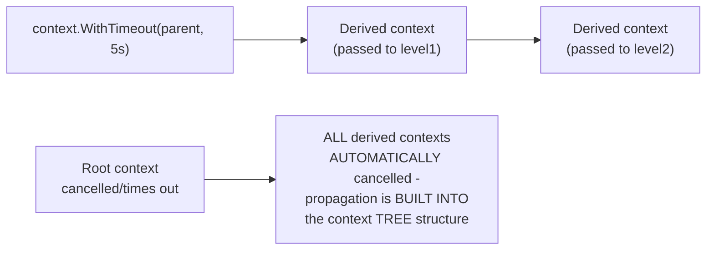

# Cancellation & Timeouts — Professional

<!-- level-focus -->
At professional level, focus on this question:

> How does Go's `context.Context` make cancellation/deadline propagation a
> language-idiomatic convention rather than an ad hoc parameter, and what
> guarantee does structured cancellation add on top?

Prerequisite: [`senior.md`](senior.md).

---

## `context.Context`: the conventional first parameter, everywhere

```go
func topLevel(ctx context.Context) error {
    return level1(ctx)
}

func level1(ctx context.Context) error {
    return level2(ctx)
}

func level2(ctx context.Context) error {
    select {
    case <-ctx.Done():
        return ctx.Err()  // cancellation or deadline signal
    default:
        // do the actual work
    }
    return nil
}
```

Go's ecosystem convention — `ctx context.Context` as the **first**
parameter of virtually every function that might block or take time —
directly addresses `senior.md`'s propagation-discipline problem by
making it a strong, near-universal idiom (enforced by linters, code
review culture, and the standard library's own APIs all expecting a
context parameter) rather than a project-specific convention easily
forgotten. `context.WithTimeout`/`WithCancel` create derived contexts
whose cancellation automatically propagates to every context derived
from them, forming a tree.



## Structured cancellation: no orphaned tasks, guaranteed

Beyond simple propagation, **structured concurrency** (covered in depth
in [Structured Concurrency](../08-structured-concurrency/README.md))
adds a further guarantee: when a scope is cancelled, **every** task
spawned within that scope is guaranteed to have either completed or been
cancelled before the scope itself returns — no task can outlive its
parent scope, "orphaned" and running unsupervised in the background.
This is a structural guarantee (Kotlin's `coroutineScope`, Swift's
`TaskGroup`, Python's `trio` nurseries) that goes beyond `senior.md`'s
manual token-threading discipline — it's enforced by the language/
library's scoping rules themselves, making the "did I forget to thread
the cancellation token somewhere" bug class structurally impossible
rather than merely disciplined-against.

## Further Reading

- Go documentation — "context" package (the standard library's
  cancellation/deadline propagation primitive).
- See also: [Structured Concurrency](../08-structured-concurrency/README.md)
  (the full treatment of the "no orphaned tasks" guarantee this page
  references).
