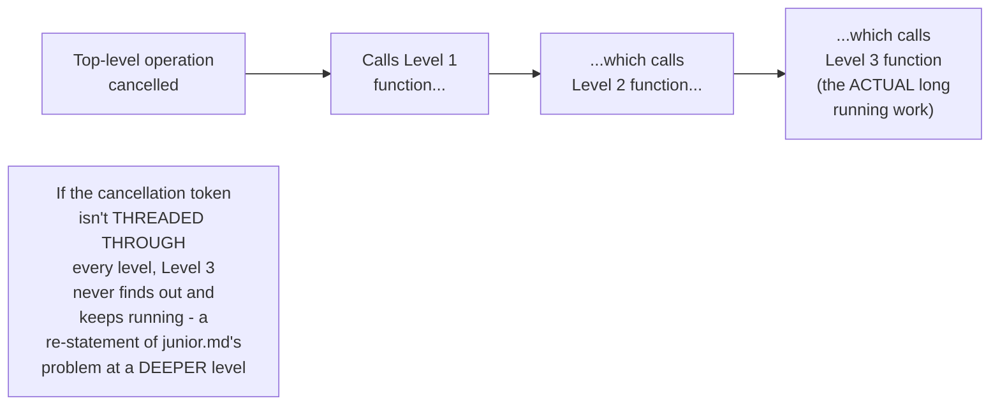
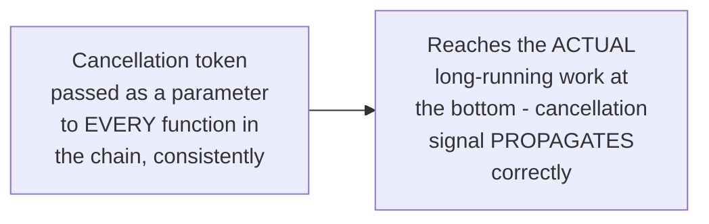

# Cancellation & Timeouts — Senior

<!-- level-focus -->
At senior level, focus on this question:

> How do you propagate a cancellation signal through a multi-level async
> call chain, so that cancelling the top-level operation actually stops
> every nested operation it spawned?

Prerequisite: [`middle.md`](middle.md).

---

## The propagation problem: a token must reach every level



If `middle.md`'s cancellation token isn't explicitly passed as a
parameter through **every** function call in the chain — Level 1 to
Level 2 to Level 3 — the deepest, actual long-running operation never
receives the cancellation signal at all, no matter how diligently the
top-level caller "cancelled" the operation. This is a real, common
implementation gap: adding cancellation support to a top-level function
without threading it through every helper function it calls
transitively achieves nothing for the parts that matter most.

## The discipline: thread the token through every async function signature

```python
async def top_level(token: CancellationToken):
    await level_1(token)

async def level_1(token: CancellationToken):
    await level_2(token)

async def level_2(token: CancellationToken):
    for item in data:
        if token.is_cancelled():
            return
        await process(item)
```



> 🎯 **Senior takeaway:** cancellation propagation requires the same
> "explicit, disciplined threading through every layer" as the multi-step
> idempotency-key derivation from the Idempotency Keys professional page —
> a single function forgetting to pass the token onward breaks
> cancellation for everything beneath it in the call chain, and this is a
> real, easy-to-introduce gap in a codebase without a strong, enforced
> convention (which is exactly why `professional.md`'s Go `context.Context`
> pattern makes this threading a language-idiomatic, hard-to-forget
> convention rather than an ad hoc parameter).

## Test yourself

1. Why does adding cancellation support only to a top-level function,
   without threading the token through every helper it calls, fail to
   actually stop the deepest, longest-running work?
2. Design the function signatures for a 4-level call chain that correctly
   propagates a cancellation token to the deepest level.
3. Why is this threading discipline easy to accidentally violate in a
   large codebase without an enforced convention?

Continue to [`professional.md`](professional.md) to see Go's
`context.Context` as the production-grade answer to this exact problem.
