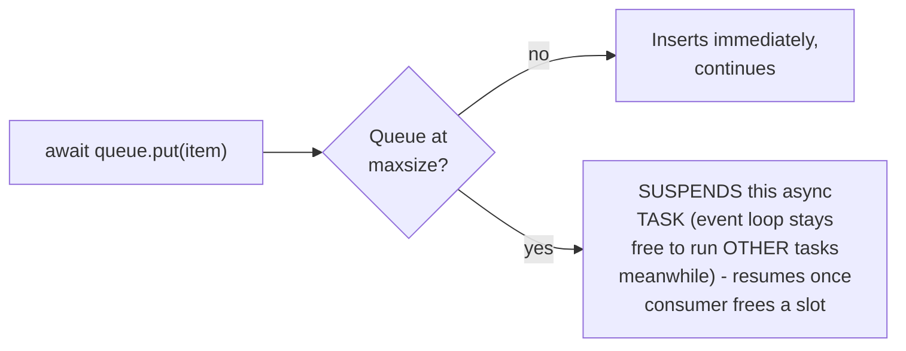

# Back-Pressure (Async) — Middle

<!-- level-focus -->
At middle level, focus on this question:

> How does a bounded async channel provide back-pressure without blocking
> an OS thread the way a bounded synchronous queue would?

Prerequisite: [`junior.md`](junior.md).

---

## Bounded async queue: `put()` suspends, doesn't block, when full

```python
queue = asyncio.Queue(maxsize=100)  # BOUNDED

async def fast_producer():
    while True:
        item = await generate_item()
        await queue.put(item)  # SUSPENDS this task (not the OS thread!)
                                  # if the queue is full, until the
                                  # consumer makes room
```



The key distinction from a synchronous bounded queue: when full,
`await queue.put(item)` suspends the **calling async task**, not the
underlying OS thread — the event loop remains free to run every **other**
async task while this specific producer task waits for space, exactly
preserving async's core value proposition (per the Why Async topic) even
while providing the exact same bounded-buffer back-pressure guarantee as
a synchronous producer-consumer pair.

> 🎓 **Takeaway:** a bounded async queue gives you the best of both
> patterns — the back-pressure safety of a bounded buffer
> (Producer-Consumer topic) combined with async's non-blocking-thread
> property (Why Async topic) — the suspension happens at the task level,
> not the thread level, so other unrelated async work continues
> uninterrupted while this specific producer waits.

## Test yourself

1. Why does `await queue.put(item)` on a full bounded queue suspend the
   task rather than blocking the thread?
2. Why does this suspension NOT prevent other unrelated async tasks from
   making progress on the same event loop?
3. Set `maxsize=10` on the queue from `junior.md`'s example and trace what
   happens once the producer has produced 10 items faster than the
   consumer has processed any.

Continue to [`senior.md`](senior.md).
