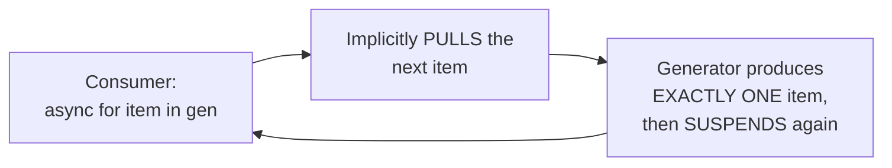

# Back-Pressure (Async) — Senior

<!-- level-focus -->
At senior level, focus on this question:

> How does an async generator provide back-pressure naturally, by
> construction, without needing an explicit bounded queue at all?

Prerequisite: [`middle.md`](middle.md).

---

## An async generator only produces the next item when asked

```python
async def generate_items():
    for raw in data_source:
        processed = await expensive_transform(raw)
        yield processed  # SUSPENDS here until the consumer
                           # asks for the NEXT item

async def consumer():
    async for item in generate_items():
        await slow_process(item)  # consumer controls the PACE -
                                     # the generator does NOT produce
                                     # item N+1 until item N has been
                                     # consumed and the loop asks again
```



This is precisely the **pull-based** back-pressure model from the full
Back-Pressure topic's middle page — the consumer's `async for` loop
implicitly "pulls" one item at a time, and the generator produces
**exactly one** item per pull, then suspends until asked for the next —
there is no possibility of the producer racing ahead of the consumer at
all, because production is entirely driven by consumption, with no
explicit bounded queue needed to enforce this.

> 🎯 **Senior takeaway:** async generators provide back-pressure "for
> free," by construction, precisely because they're pull-based rather
> than push-based — this is a structurally simpler and more naturally
> back-pressure-safe pattern than a producer pushing into a bounded
> queue (`middle.md`), whenever your workload shape allows a pull-based
> design (the producer and consumer are directly connected, without
> needing to fan out to multiple independent consumers, which would
> require the queue-based approach instead).

## Test yourself

1. Why does an async generator's pull-based design make explicit
   back-pressure bookkeeping (a bounded queue size) unnecessary?
2. Why might a bounded queue still be preferable over a plain async
   generator for a scenario with multiple independent consumers?
3. Rewrite `junior.md`'s fast-producer/slow-consumer example using an
   async generator instead of a queue, and explain why this eliminates
   the unbounded-growth risk entirely.

Continue to [`professional.md`](professional.md) to evaluate
backpressure-aware reactive-streams-compliant libraries at scale.
