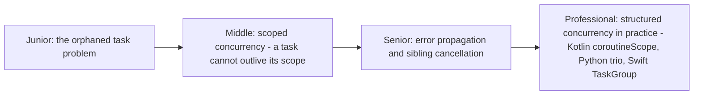
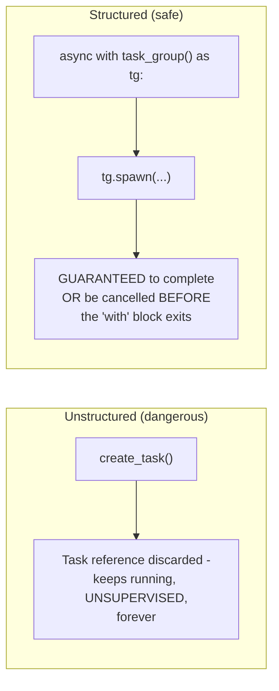

# Structured Concurrency

> A discipline (not a specific library) that guarantees every concurrently
> spawned task's lifetime is bounded by an enclosing scope — no task can
> "escape" and keep running unsupervised after its parent scope exits.
> The structural fix for the orphaned-task class of bugs that plagues
> unstructured `create_task()`-style concurrency.

## Choose a level

| Level | Guide | You are done when |
|---|---|---|
| Junior | [The orphaned task problem](junior.md) | You can explain why `create_task()` without tracking the returned task is a real bug risk. |
| Middle | [Scoped concurrency](middle.md) | You can implement a task-group-style scope that waits for all spawned tasks before exiting. |
| Senior | [Error propagation and sibling cancellation](senior.md) | You can explain what should happen to sibling tasks when one fails inside a structured scope. |
| Professional | [Structured concurrency across languages](professional.md) | You can compare Kotlin's coroutineScope, Python's trio nurseries, and Swift's TaskGroup. |

## Practice rule

Before calling `create_task()` (or equivalent) and discarding the
returned handle, ask: "does anything guarantee this task completes,
fails visibly, or gets cancelled before my function returns?" If not,
you've created an orphaned task — structured concurrency exists
specifically to make this question unnecessary to ask.

## Related

- [Cancellation & Timeouts](../06-cancellation-and-timeouts/README.md)
- [Fan-Out / Fan-In](../../concurrency/03-patterns/03-fan-in-fan-out/README.md)
