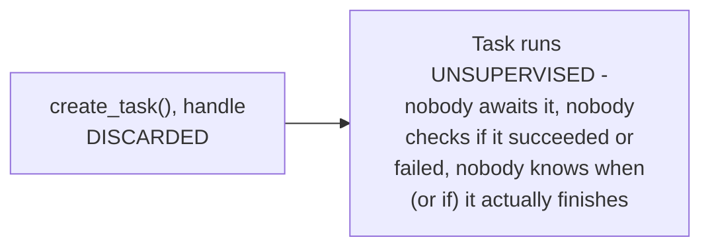

# Structured Concurrency — Junior

<!-- level-focus -->
At junior level, focus on this question:

> Why is spawning a task and discarding the returned handle a real, if
> subtle, bug risk?

---

## An orphaned task: nobody's watching it

```python
async def handle_request():
    asyncio.create_task(log_analytics_event())  # handle DISCARDED
    return "response sent"
# handle_request() returns immediately - but does log_analytics_event()
# actually finish? Does anyone know if it FAILED? Nobody is watching.
```



If the spawned task raises an exception, that exception is often
**silently swallowed** (many async runtimes log a warning at best,
buried in logs) — nobody's code path is positioned to notice or handle
it, because nobody is `await`ing the task's result. If the enclosing
function (`handle_request`) returns and the underlying request context
is torn down, the orphaned task might even be silently cancelled
mid-work, or continue running against resources that are no longer
valid.

> 🎓 **Takeaway:** `create_task()` without tracking the resulting handle
> creates a task with an **unbounded, unsupervised** lifetime — it might
> finish, fail silently, or keep running well past the point where
> anything makes logical sense for it to still be running. This is
> exactly the class of bug structured concurrency (`middle.md`) exists to
> make structurally impossible.

## Test yourself

1. What happens to an exception raised inside a `create_task()`-spawned
   task whose handle was discarded?
2. Why might an orphaned task still be "running" after the function that
   spawned it has already returned?
3. Give a real production scenario where an orphaned task's silent
   failure could cause a hard-to-diagnose bug.

Continue to [`middle.md`](middle.md).
