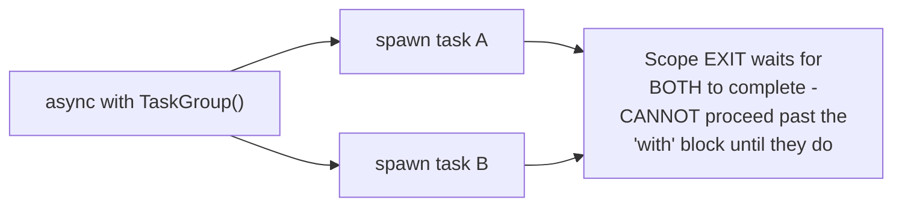

# Structured Concurrency — Middle

<!-- level-focus -->
At middle level, focus on this question:

> How does a scoped task group guarantee every spawned task completes (or
> is cancelled) before the enclosing scope exits?

Prerequisite: [`junior.md`](junior.md).

---

## The scope binds every spawned task's lifetime

```python
async def handle_request():
    async with asyncio.TaskGroup() as tg:  # Python 3.11+ structured concurrency
        tg.create_task(log_analytics_event())
        tg.create_task(update_cache())
    # The 'async with' block does NOT exit until BOTH spawned tasks
    # have completed - GUARANTEED, no orphaned tasks possible
    return "response sent"
```



The task group's context manager (`async with`) structurally **cannot**
exit until every task spawned within it has finished — this is enforced
by the language/library construct itself, not by programmer discipline
(`junior.md`'s "did I remember to await it" question becomes structurally
unaskable, because the scope's exit is the guarantee).

> 🎓 **Takeaway:** structured concurrency converts "did every spawned
> task get properly awaited/tracked?" from a discipline you must
> remember and get right every time, into a guarantee enforced by the
> scope's own control-flow structure — the same "make the incorrect
> thing impossible to express" principle as Rust's borrow checker
> (per the Shared-Memory Concurrency middle page's discussion of that
> same principle applied to a different concurrency-safety problem).

## Test yourself

1. Why can the `async with TaskGroup()` block not proceed past its own
   exit until every spawned task completes?
2. Why does this eliminate `junior.md`'s exact orphaned-task risk,
   structurally rather than through discipline?
3. Rewrite `junior.md`'s `handle_request` example using a task group so
   the analytics logging task's failure would actually be visible.

Continue to [`senior.md`](senior.md).
