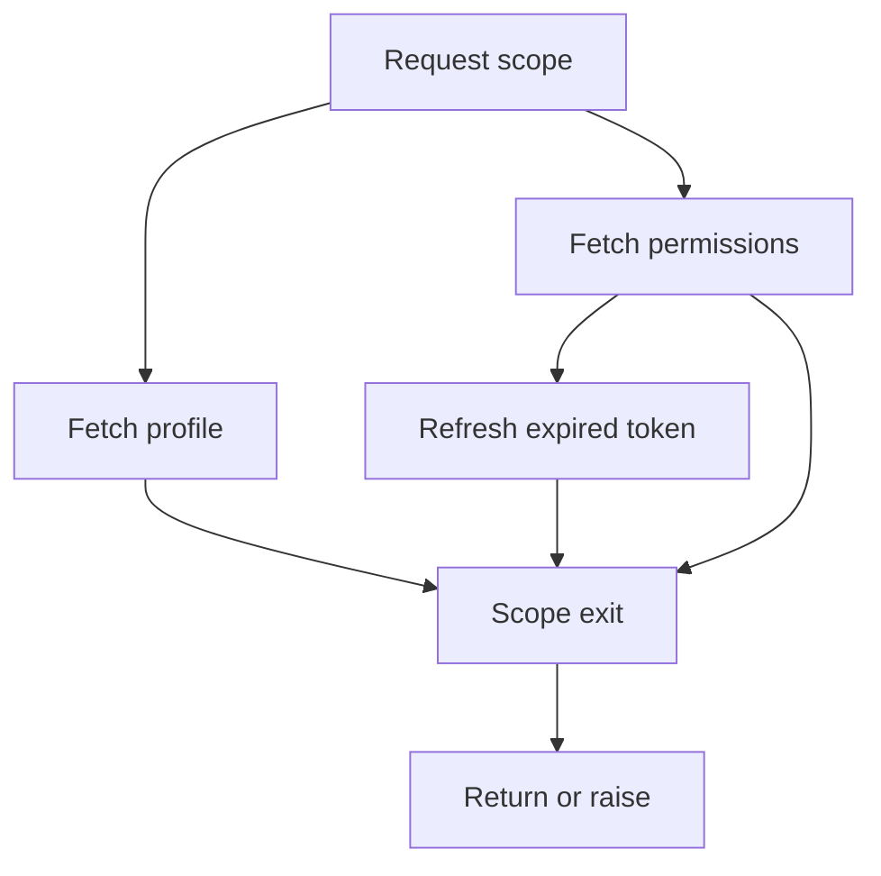

# Structured Concurrency - Professional

> Structured concurrency makes task lifetime, failure propagation, and
> cancellation part of control flow rather than conventions layered over it.

## The invariant

A concurrent scope does not return until every child it started has reached a
terminal state. Child failures are observed, cancellation flows down the task
tree, and completion flows back up it.



This is the concurrency analogue of lexical resource management. A file opened
in a `with` block cannot remain accidentally owned by that block after exit; a
child task in a structured scope should have the same lifetime property.

## Real implementations

### Kotlin: jobs form a hierarchy

`coroutineScope` creates a child `Job` and suspends until all children finish.
An uncaught child failure cancels the parent job and its siblings. Cancellation
is cooperative and is observed at suspension points or through explicit
`ensureActive()` checks. `supervisorScope` changes one policy: a child's failure
does not automatically cancel siblings, so the owner must inspect failures.

The dangerous escape hatch is `GlobalScope`. It has no useful parent lifetime,
so work can survive the request, component, or test that started it. Production
services should usually inject an application-owned scope whose shutdown path
cancels and joins its job tree.

### Python: TaskGroup and Trio nurseries

Python 3.11's `asyncio.TaskGroup` cancels remaining children when one raises a
non-cancellation exception, waits for them, then raises an `ExceptionGroup`.
This preserves multiple simultaneous failures rather than selecting an
arbitrary winner. Code handling the result may use `except*` to process error
types independently.

Trio's nursery model influenced this API. Trio also uses cancel scopes and
checkpoint-based cancellation. A CPU loop with no checkpoint can still delay
scope shutdown indefinitely: structure gives ownership, not preemption.

### Swift: task groups versus unstructured tasks

Swift's `withThrowingTaskGroup` bounds child tasks to a lexical scope and
supports explicit `cancelAll()`. Cancellation remains advisory; children must
check `Task.isCancelled`, call `Task.checkCancellation()`, or reach an API that
does so. `Task.detached` discards actor, priority, and task-local inheritance and
should be treated as an explicit ownership boundary, not a convenient spawn.

## Semantics that designs must decide

| Decision | Fail-fast scope | Supervising scope |
|---|---|---|
| One child fails | Cancel siblings | Keep siblings running |
| Result contract | Whole operation fails | Partial result is possible |
| Typical use | Parallel pieces of one answer | Independent long-lived workers |
| Main risk | Slow cancellation delays failure | Lost or unreported child errors |

Timeouts are budgets, not independent constants. If a parent has 200 ms left,
a child cannot honestly receive a fresh 500 ms deadline. Derive child deadlines
from the parent's remaining budget and reserve time for cleanup and response
serialization.

Shielding cancellation should be narrow. Shield the small commit or cleanup
section whose interruption would violate an invariant, not an entire request.
Otherwise shutdown latency becomes unbounded and deploys accumulate overlapping
instances still doing old work.

## Scale and failure behavior

Task trees improve ownership but do not bound fan-out. A scope that creates one
million children can consume hundreds of megabytes in task objects, stacks or
continuation frames, timers, and tracing context before useful work completes.
Pair structure with a semaphore, bounded channel, or worker pool.

Cancellation storms expose hidden costs. A deadline shared by 50,000 children
can wake all of them together, causing scheduler contention and a burst of
downstream cleanup calls. Stagger deadlines where semantics allow, make cleanup
idempotent, and keep cancellation handlers allocation-light.

Watch for these production symptoms:

- growing active-task count after request throughput falls;
- scope-exit latency much larger than request latency;
- high cancelled-to-completed ratios and deadline clustering;
- detached-task exceptions logged without request or owner identity;
- shutdown exceeding the orchestrator's grace period;
- child fan-out and scheduler run-queue depth rising together.

## Operations and incident response

Instrument scopes with owner, operation, deadline, child count, completion
state, and cancellation cause. Traces should represent parent-child task links,
but avoid recording every tiny task when cardinality would overwhelm the
telemetry backend.

For a service that will not terminate during deployment:

1. Capture task dumps and identify the oldest non-terminal scope.
2. Compare its deadline with the current time and inspect children that have not
   reached cancellation checkpoints.
3. Check for blocking calls executed on event-loop threads and shielded regions.
4. Confirm downstream clients receive the parent cancellation or deadline.
5. Bound the immediate leak, then add a regression test that cancels the parent
   while every child is at a distinct lifecycle stage.

A typical postmortem reads: a request timed out, one child ignored cancellation
inside a blocking SDK call, the task group could not exit, and rolling deploys
created overlapping work. The corrective action is not merely "increase the
timeout"; it is to restore cancellation propagation, offload or replace the
blocking call, and bound shutdown.

## Design and ops checklist

- Define one explicit owner and lifetime for every spawned task.
- Choose fail-fast or supervision semantics from the result contract.
- Propagate cancellation causes and the parent's remaining deadline budget.
- Bound child count independently of task-lifetime structure.
- Ensure CPU loops and foreign-library calls reach cancellation checkpoints.
- Make cleanup idempotent and place only invariant-critical work in shields.
- Test simultaneous child failures, parent cancellation, and shutdown races.
- Dashboard active children, oldest scope age, scope-exit latency, and outcomes.
- Prohibit detached/global tasks unless their application-level owner is named.

```text
STRUCTURED CONCURRENCY CHEAT SHEET
ownership       parent scope owns every child
normal exit     join all children before returning
child failure   cancel siblings or supervise explicitly
parent cancel   propagate downward; children cooperate
fan-out         structure does not imply a bound
escape hatch    detached task requires a new named owner
```

## Test yourself

1. A search endpoint fans out to 2,000 shards and returns the best partial result.
   Which tasks belong in a supervising scope, and how will you bound fan-out?
2. A deploy hangs because a cancelled child is inside a native database driver.
   What evidence distinguishes missing propagation from non-cooperative code?
3. How would you preserve all concurrent child failures without letting sibling
   errors disappear behind the first exception?
4. When is shielding cancellation necessary, and what scope-size limit would you
   enforce in review?

## Further reading

- Nathaniel J. Smith, "Notes on Structured Concurrency, or: Go Statement
  Considered Harmful."
- Martin Sustrik, "Structured Concurrency."
- Kotlin documentation, "CoroutineScope" and "Cancellation and Timeouts."
- CPython source: `Lib/asyncio/taskgroups.py`; PEP 654, Exception Groups.
- Trio documentation, "Nurseries and spawning."
- Swift Evolution SE-0304, "Structured Concurrency."
