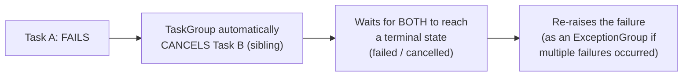

# Structured Concurrency — Senior

<!-- level-focus -->
At senior level, focus on this question:

> When one task inside a structured scope fails, what should happen to
> its still-running siblings?

Prerequisite: [`middle.md`](middle.md).

---

## The default: one failure cancels all siblings, then re-raises

```python
async def handle_request():
    async with asyncio.TaskGroup() as tg:
        tg.create_task(fetch_user_data())    # fails partway through
        tg.create_task(fetch_order_history())  # still running
    # If fetch_user_data() raises an exception:
    # 1. fetch_order_history() is AUTOMATICALLY CANCELLED
    # 2. The TaskGroup itself raises an ExceptionGroup once both
    #    are resolved (one failed, one cancelled)
```



This default — **one failure cancels every sibling** — directly connects
to `middle.md`'s independence-vs-fail-fast decision from the Fan-Out/
Fan-In senior page: a structured task group's default behavior is
essentially **fail-fast** semantics applied automatically. If your use
case actually wants partial-success semantics instead (independent tasks
whose individual failures shouldn't cancel unrelated siblings), most
structured concurrency libraries provide an explicit opt-out (a
"shielded" task, or catching exceptions **inside** each task before they
propagate to the group) — but the safe, structurally-enforced default is
fail-fast, precisely because it prevents the ambiguous "some tasks
succeeded, some failed, some were silently abandoned" state that
unstructured concurrency (`junior.md`) permits.

> 🎯 **Senior takeaway:** structured concurrency's default sibling-
> cancellation-on-failure behavior is a deliberate, safety-first design
> choice — it converts "partial, ambiguous failure" into "the whole scope
> fails cleanly, with every task accounted for" by default, requiring an
> explicit, visible opt-out for genuine partial-success use cases rather
> than making ambiguous partial failure the silent default.

## Test yourself

1. Why does one task's failure automatically cancel its siblings in a
   structured concurrency scope, by default?
2. How would you opt into partial-success semantics (some tasks failing
   shouldn't cancel unrelated siblings) within a structured concurrency
   framework?
3. Why is "fail-fast by default, explicit opt-out for partial success" a
   safer default than the reverse?

Continue to [`professional.md`](professional.md) to compare structured
concurrency implementations across Kotlin, Python, and Swift.
