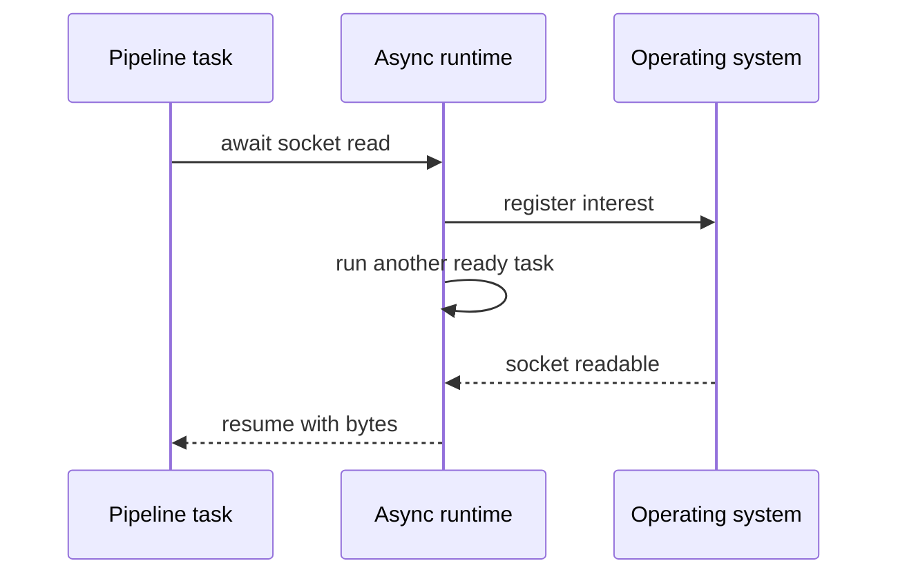

# Async Runtimes - Junior

> What executes an async function after it suspends?

An Airflow trigger, Kafka client, or object-store request may use `await`, but
the keyword does not contact the operating system or decide what runs next. The
runtime performs those jobs.

```python
async def load_partition(client, key):
    return await client.get_object(key)
```

Calling this creates coroutine work. Scheduling it gives the runtime a task.
When `get_object` waits for the network, the runtime records the wait and runs
another ready task. When the socket becomes readable, the runtime makes the
original task ready again.



The runtime commonly owns:

- a ready-task queue and scheduler;
- an OS I/O poller;
- timers and timeout wake-ups;
- worker threads for blocking operations;
- task cancellation and diagnostics.

The naive mistake is to assume all async runtimes behave identically. Python's
`asyncio` normally runs Python callbacks on one loop thread; Tokio and .NET can
schedule work over multiple workers. The same syntax can therefore have very
different scheduling and thread-safety consequences.

## Test yourself

1. Which component notices that a network socket is ready?
2. What is the difference between a coroutine and a scheduled task?
3. Why can identical `await` syntax have different thread behavior by runtime?

Continue to [`middle.md`](middle.md).
