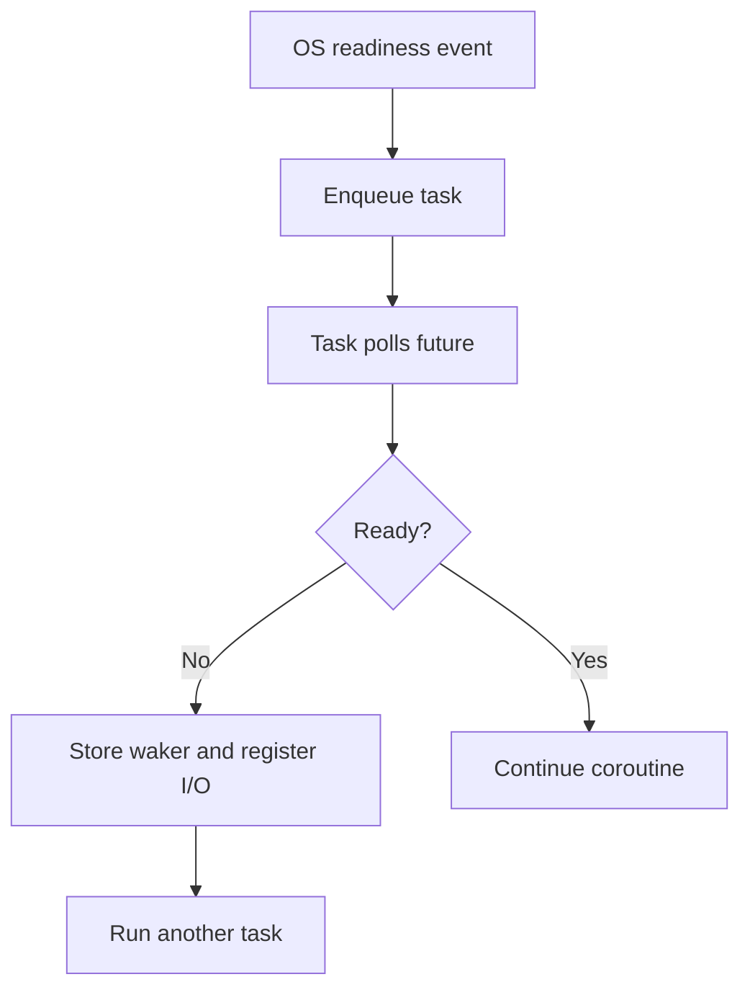

# Async Runtimes - Middle

> Trace a task through the reactor, scheduler, and blocking pool.

Consider a service that concurrently reads object-store manifests and parses
their JSON metadata:

```python
async def inspect(client, keys):
    async def one(key):
        body = await client.get_object(key)       # non-blocking I/O
        return await asyncio.to_thread(parse, body)  # blocking/CPU boundary
    return await asyncio.gather(*(one(k) for k in keys))
```

The network phase registers a socket with the reactor. The task becomes pending,
so it consumes memory but no worker turn. Readiness enqueues it again. Parsing is
offloaded because a long synchronous parser would otherwise occupy the event
loop and delay unrelated Kafka heartbeats and timeout callbacks.



| Work | Runtime path | Capacity control |
|---|---|---|
| Socket or async file API | I/O poller | Connection/semaphore limit |
| Short callback | Event-loop worker | Cooperative yield points |
| Blocking SDK call | Blocking pool | Small bounded pool/queue |
| Sustained CPU transform | Process/compute pool | Core and memory budget |

Creating 100,000 tasks is not the same as executing 100,000 operations at once.
Add a semaphore around remote calls so descriptors, memory, and downstream
quotas remain bounded.

## Test yourself

1. Why is a pending socket task cheaper than a blocked thread?
2. Where should synchronous JSON parsing run if it lasts 100 ms?
3. Which limit protects an object store from unbounded task fan-out?

Continue to [`senior.md`](senior.md).
