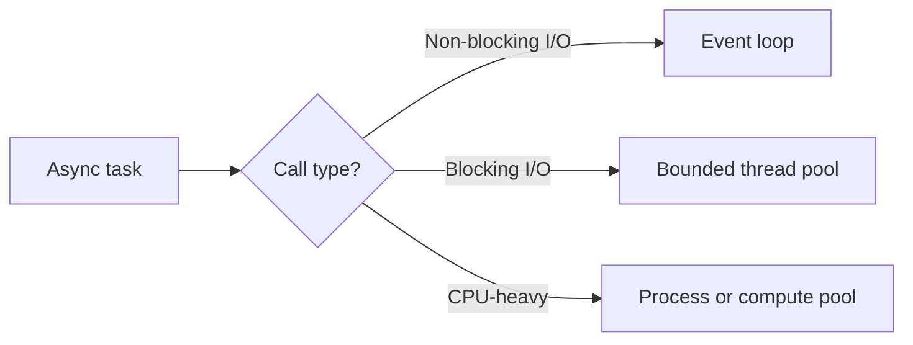

# Mixing Async and Blocking

> One blocking call on an event-loop thread can stall thousands of unrelated
> tasks; isolate it, replace it, or make the boundary explicit.

## Choose a level

| Level | Guide | You are done when |
|---|---|---|
| Junior | [Spot blocking calls](junior.md) | You can explain how one sync call stalls unrelated tasks. |
| Middle | [Offload boundaries](middle.md) | You can select thread, process, or native async execution. |
| Senior | [Pool isolation and overload](senior.md) | You can prevent queue growth and pool starvation. |
| Professional | [Starvation mechanics](professional.md) | You can review sync/async boundaries across major runtimes. |

## Practice rule

Every dependency called from event-loop code needs a known classification:
non-blocking, short CPU, blocking I/O, or sustained CPU.

## Related

- [Async Runtimes](../09-async-runtimes/README.md)
- [Async Anti-patterns](../12-anti-patterns/README.md)
