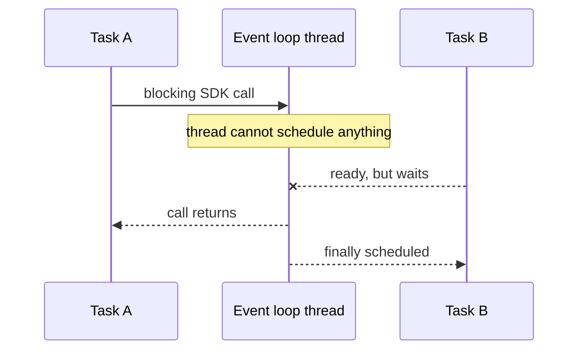

# Mixing Async and Blocking - Junior

> Why does `time.sleep()` inside one coroutine delay every other coroutine?

```python
async def poll_job(job_id):
    status = warehouse_sdk.get_status(job_id)  # synchronous network wait
    time.sleep(1)                              # blocks the loop thread
    return status
```

`async def` does not transform synchronous calls into non-blocking operations.
Until this function reaches a real suspension point, it owns the event-loop
thread. Kafka heartbeats, timeout callbacks, and other warehouse polls wait.



The naive fix, adding `async` to `poll_job`, changes only its calling convention.
Use a genuinely async client or move the blocking call away from the loop.

## Test yourself

1. Why does `async def` not make `time.sleep()` non-blocking?
2. Which pipeline control messages can be harmed by event-loop stalls?
3. How would you identify whether a third-party SDK is synchronous?

Continue to [`middle.md`](middle.md).
