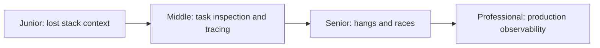
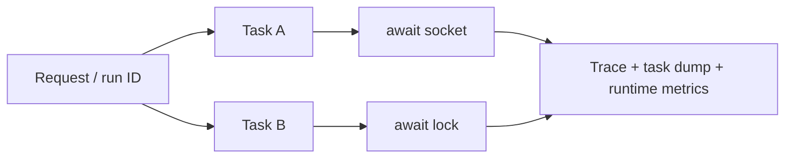

# Debugging Async Code

> Async failures cross task and `await` boundaries, so debugging needs task
> state, causal context, and scheduler evidence in addition to thread stacks.

## Choose a level

| Level | Guide | You are done when |
|---|---|---|
| Junior | [Why ordinary stacks are insufficient](junior.md) | You can explain why suspended callers disappear from thread stacks. |
| Middle | [Inspect tasks and propagate context](middle.md) | You can name tasks and correlate logs across awaits. |
| Senior | [Diagnose hangs and races](senior.md) | You can investigate deadlocks, starvation, and cancellation races. |
| Professional | [Production observability](professional.md) | You can design low-overhead causal diagnostics across runtimes. |

## Practice rule

Capture a task dump, thread dump, runtime metrics, and correlated trace before
restarting a hung process; any one artifact alone is incomplete.

## Related

- [Async Runtimes](../09-async-runtimes/README.md)
- [Deadlock Detection](../../concurrency/06-deadlock-detection/README.md)
