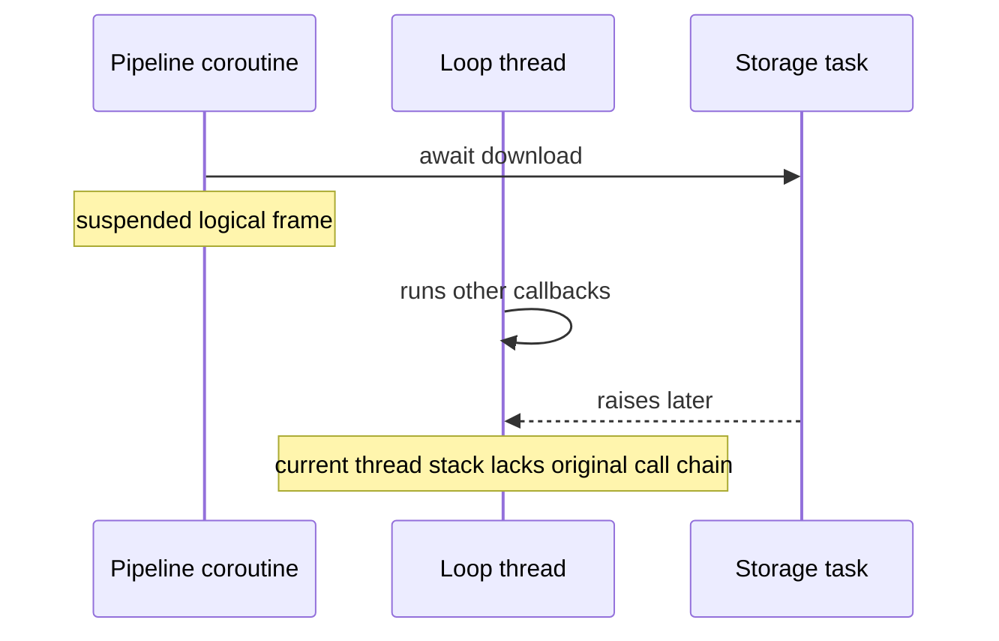

# Debugging Async Code - Junior

> Why can a thread stack show the event loop but not the pipeline operation that
> originally awaited a failed task?

When a coroutine suspends, its logical call frames live in coroutine/task state,
not as active frames on the OS thread. The thread may now execute an unrelated
Kafka consumer callback. A traditional thread dump therefore shows where the
thread is now, not the full causal chain that created the suspended work.

Name tasks and include stable run, partition, and operation IDs in logs. Do not
discard task handles: an unobserved exception may surface only as a generic
runtime warning after the useful context has disappeared.

## Test yourself

1. Where are suspended coroutine frames stored?
2. Why is a thread dump alone insufficient for an async hang?
3. Which identifiers help correlate a failed object-store task to its run?

Continue to [`middle.md`](middle.md).
