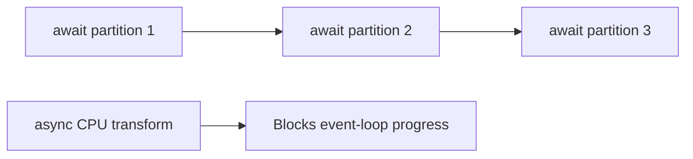

# Async Programming Anti-patterns - Junior

> `async` syntax does not guarantee concurrency or non-blocking behavior.

This loop is async but sequential:

```python
for partition in partitions:
    await load_partition(partition)
```

Each load starts only after the previous one finishes. Sequential execution may
be correct, but adding `async` did not create overlap. This version is worse:

```python
async def transform(rows):
    return expensive_python_transform(rows)  # CPU work; no suspension
```

It is "fake async": the function monopolizes the event loop and gains nothing
from the async calling convention.



Use async for overlapping waits. Use ordinary synchronous code when simplicity
wins, and parallel compute when CPU work is the bottleneck.

## Test yourself

1. Why is awaiting inside a loop often sequential?
2. What makes a function "fake async"?
3. Which model suits CPU-heavy row transformation?

Continue to [`middle.md`](middle.md).
