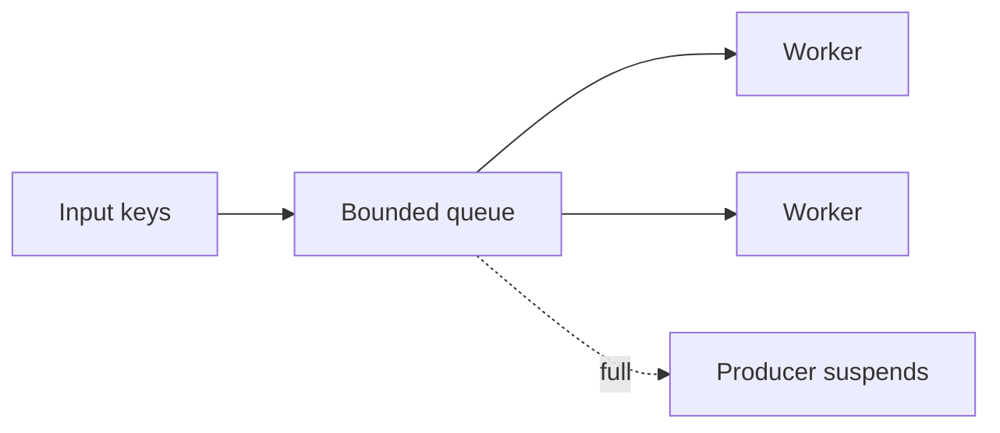

# Async Programming Anti-patterns - Middle

> Unbounded fan-out and fire-and-forget replace visible waiting with invisible
> overload and failure.

```python
# Dangerous: one task per object, no bound and no clear owner.
for key in million_keys:
    asyncio.create_task(copy_object(key))
```

The tasks allocate memory, open connections, and pressure the destination.
Discarded handles also lose exceptions. Use structured ownership and a bound:

```python
limit = asyncio.Semaphore(64)

async def bounded_copy(key):
    async with limit:
        await copy_object(key)

async with asyncio.TaskGroup() as group:
    for key in keys:
        group.create_task(bounded_copy(key))
```

For a very large input, even bounded execution with one pre-created task per key
uses excess memory. Prefer a bounded queue and fixed worker tasks so pending work
remains data records, not full task objects.



## Test yourself

1. Why does a semaphore not eliminate the cost of one million created tasks?
2. How does a task group make failures visible?
3. When is a fixed worker pool preferable to `gather` over all inputs?

Continue to [`senior.md`](senior.md).
