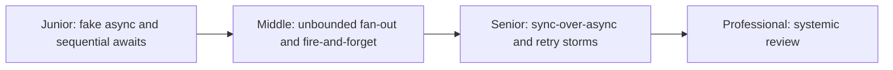
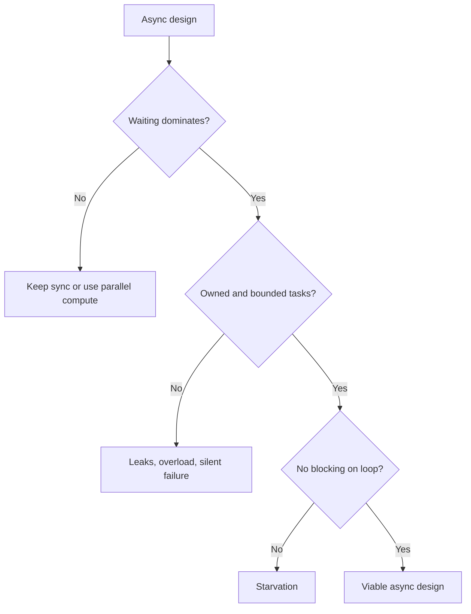

# Async Programming Anti-patterns

> Async code fails when concurrency is unowned, unbounded, accidentally
> blocking, or introduced where waiting was never the bottleneck.

## Choose a level

| Level | Guide | You are done when |
|---|---|---|
| Junior | [Fake concurrency](junior.md) | You can spot fake async and accidentally sequential awaits. |
| Middle | [Unbounded and unowned tasks](middle.md) | You can bound fan-out and replace fire-and-forget. |
| Senior | [Deadlocks and retry amplification](senior.md) | You can prevent sync-over-async and cancellation/retry failures. |
| Professional | [Systemic async review](professional.md) | You can review lifecycle, capacity, and runtime hazards together. |

## Practice rule

For every spawn, identify the owner, concurrency bound, deadline, failure
observer, and shutdown behavior. Missing one is a design defect.

## Related

- [Structured Concurrency](../structured-concurrency/README.md)
- [Mixing Async and Blocking](../mixing-async-and-blocking/README.md)
