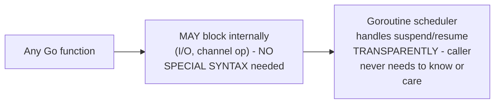

# `async`/`await` Syntax — Professional

<!-- level-focus -->
At professional level, focus on this question:

> How does Go's goroutine model avoid function coloring entirely, and
> what does that design choice cost in exchange?

Prerequisite: [`senior.md`](senior.md).

---

## Go: every function is implicitly "async-capable," no coloring needed

```go
func getUser(userID int) User {
    row := db.QueryRow("SELECT ...", userID)  // this call MIGHT block
                                                 // on I/O internally,
                                                 // but the function
                                                 // signature looks
                                                 // COMPLETELY ordinary
    return parseUser(row)
}

func handler() {
    user := getUser(42)  // called EXACTLY like any normal function -
                           // no await, no async keyword, anywhere
}
```

Recall from the Coroutines & Generators middle page: Go's goroutines are
**stackful** — any function, at any point in its call graph, can block
(on a channel operation, on I/O) and the goroutine scheduler transparently
suspends and resumes it, with **zero** syntax marking required. This is
the direct, deliberate design choice that eliminates `middle.md`'s entire
function-coloring propagation problem — there is no "async" keyword,
no "await" keyword, and no distinction between a function that "might
block" and one that doesn't, at the type-signature level.



## What this design choice costs

The cost is precisely the stackful-coroutine memory overhead from the
Coroutines & Generators middle page (each goroutine needs its own,
though growable/segmented, stack — larger per-unit memory footprint than
a stackless coroutine's small state-machine object) and a loss of
**compile-time visibility** into which specific calls might block —
in an `async`/`await` language, the type signature itself documents "this
function might suspend here"; in Go, this information is invisible at
the call site, requiring either documentation or runtime profiling to
discover.

> 🎯 **Professional-level insight:** Go's designers made a deliberate,
> explicit trade: eliminate function coloring's viral propagation and
> syntactic overhead entirely, at the cost of a larger per-goroutine
> memory footprint and losing compile-time visibility into blocking
> behavior. Neither choice (stackless async/await with coloring, or
> stackful goroutines without it) is universally superior — this is
> precisely the kind of language-design trade-off a staff engineer
> should be able to articulate when asked "why doesn't Go have async/
> await," rather than treating it as an arbitrary omission.

## Further Reading

- Rob Pike — various talks and writings on Go's concurrency design
  philosophy (goroutines vs. async/await, explicitly contrasted).
- Bob Nystrom — "What Color is Your Function?" (the essay that named and
  popularized this entire framing).
- See also: [Coroutines & Generators — middle](../coroutines-and-generators/middle.md)
  (stackful vs. stackless, the mechanism underlying this trade-off).
