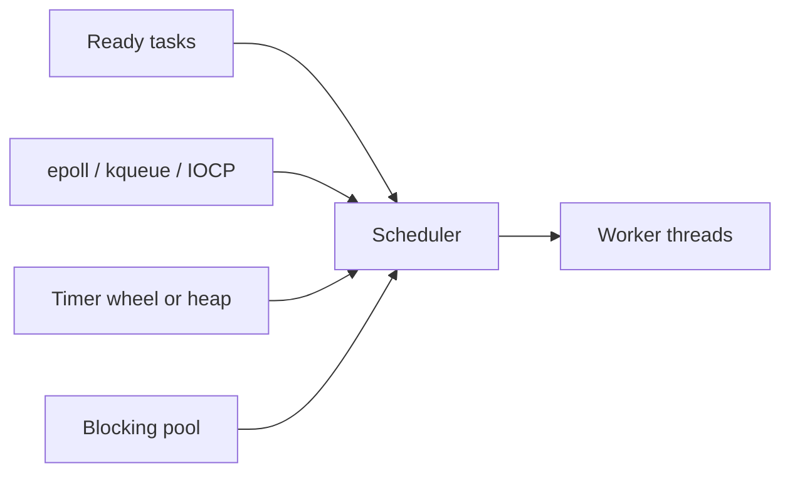

# Async Runtimes

> `async` syntax describes suspendable work; a runtime supplies the scheduler,
> timers, I/O polling, task queues, and blocking-work escape hatches that run it.

## Choose a level

| Level | Guide | You are done when |
|---|---|---|
| Junior | [What the runtime does](junior.md) | You can separate language syntax from runtime services. |
| Middle | [Reactor and scheduler](middle.md) | You can trace an I/O-bound task through polling, suspension, and wake-up. |
| Senior | [Selection and tuning](senior.md) | You can choose runtime settings from workload and failure evidence. |
| Professional | [Runtime internals](professional.md) | You can compare Tokio, libuv, asyncio, and .NET operationally. |

## Practice rule

Do not tune worker counts until you know whether time is spent on event-loop
work, blocking-pool work, CPU work, or downstream waiting.

## Related

- [The Event Loop](../event-loop/README.md)
- [Mixing Async and Blocking](../mixing-async-and-blocking/README.md)
