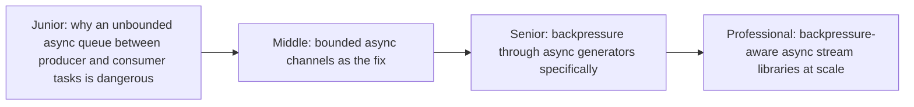
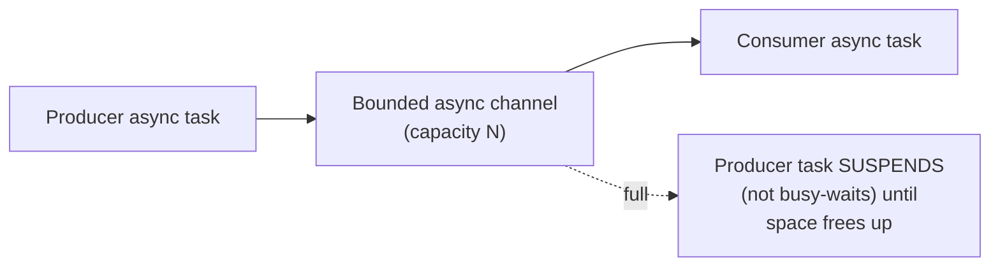

# Back-Pressure (Async Programming Context)

> The general back-pressure concept is covered in full depth in
> [Back-Pressure](../../../event-streaming/asynchronism/back-pressure/README.md).
> This page focuses specifically on how it manifests within a single
> async runtime — bounded async channels/queues and async generators —
> rather than across network/service boundaries.

## Choose a level

| Level | Guide | You are done when |
|---|---|---|
| Junior | [Unbounded async queues are still dangerous](junior.md) | You can explain why "it's async, so it's fine" doesn't protect against unbounded memory growth. |
| Middle | [Bounded async channels](middle.md) | You can implement a producer/consumer pair using a bounded async queue that suspends (not blocks) when full. |
| Senior | [Backpressure through async generators](senior.md) | You can explain how an async generator's consumer naturally provides backpressure by construction. |
| Professional | [Backpressure-aware stream libraries](professional.md) | You can evaluate a reactive-streams-compliant async library's backpressure guarantees. |

## Practice rule

An unbounded `asyncio.Queue()` (no `maxsize`) between a fast async
producer and a slow async consumer has the exact same unbounded-memory-
growth risk as any other unbounded queue covered elsewhere in this tree —
"it's async" changes nothing about this risk.

## Related

- [Back-Pressure (full treatment)](../../../event-streaming/asynchronism/back-pressure/README.md)
- [Producer-Consumer](../../concurrency/patterns/producer-consumer/README.md)
