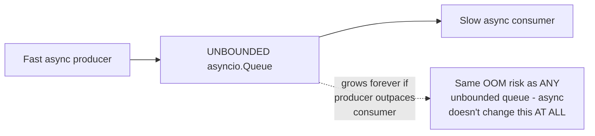

# Back-Pressure (Async) — Junior

<!-- level-focus -->
At junior level, focus on this question:

> Why does "it's async, so it's non-blocking" not protect against
> unbounded memory growth between a fast async producer and a slow async
> consumer?

---

## Async removes blocking, not the queue-growth risk

```python
import asyncio

queue = asyncio.Queue()  # NO maxsize - UNBOUNDED

async def fast_producer():
    while True:
        item = await generate_item()  # fast
        await queue.put(item)  # NEVER blocks meaningfully - queue
                                  # has no size limit to hit

async def slow_consumer():
    while True:
        item = await queue.get()
        await slow_process(item)  # slow
```



This is exactly the same unbounded-buffer risk from
[Producer-Consumer — junior](../../concurrency/patterns/producer-consumer/junior.md),
just with `async`/`await` syntax instead of OS threads — the fact that
neither task **blocks** an OS thread while waiting doesn't change
anything about whether the **queue itself** has a size limit. An
unbounded `asyncio.Queue()` will grow without limit exactly like an
unbounded plain queue would, consuming memory until the process runs
out.

> 🎓 **Takeaway:** async programming solves the "don't block a thread
> while waiting" problem — it says nothing, by itself, about bounding
> queue sizes between producers and consumers. The back-pressure
> discipline from the full Back-Pressure topic applies identically here;
> async is not a magic fix for this specific risk.

## Test yourself

1. Why doesn't using `async`/`await` for both producer and consumer
   change anything about the unbounded-queue-growth risk?
2. What specific configuration would you change in the code above to add
   a size limit?
3. Why might an engineer mistakenly believe "async code is inherently
   safe from this problem"?

Continue to [`middle.md`](middle.md).
