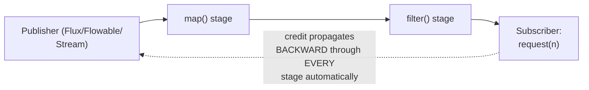

# Back-Pressure (Async) — Professional

<!-- level-focus -->
At professional level, focus on this question:

> How do production reactive-streams-compliant async libraries (Project
> Reactor, RxJava, Rust's `futures::Stream`) formalize back-pressure
> beyond ad hoc bounded queues and generators?

Prerequisite: [`senior.md`](senior.md).

---

## The Reactive Streams protocol, applied to async streams specifically

Recall the Reactive Streams specification from the full Back-Pressure
topic's professional page: a formal `Publisher`/`Subscriber` protocol
where the subscriber calls `request(n)` to grant explicit credit, and the
publisher is contractually bound to send at most `n` items. Applied to
async programming specifically, this generalizes both `middle.md`'s
bounded-queue approach and `senior.md`'s pull-based generator approach
into one unified, composable abstraction — Project Reactor's `Flux`,
RxJava's `Flowable`, and Rust's `Stream` trait all implement variations
of this exact contract, letting you compose complex pipelines (multiple
transformation stages, fan-out to multiple subscribers with independent
consumption rates) while preserving back-pressure correctness throughout
the whole pipeline automatically.

## Why this matters more than hand-rolled bounded queues at scale

A hand-rolled pipeline of multiple bounded queues (one between each
processing stage, per `middle.md`) requires manually reasoning about
back-pressure propagation across **every** stage boundary — exactly the
"every hop must propagate the signal" senior-level lesson from the full
Back-Pressure topic's senior page, applied here. A reactive-streams-based
library handles this propagation **automatically and correctly** across
an arbitrarily long chain of transformation operators, because the
`request(n)` credit mechanism is built into the operator-composition
semantics itself — you don't need to manually verify every stage
propagates pressure correctly; the library's contract guarantees it.

## Production checklist (staff-level)

1. **Use a reactive-streams-compliant library for any complex, multi-
   stage async processing pipeline** rather than hand-composing bounded
   queues between stages — the automatic, verified back-pressure
   propagation is a significant correctness and maintenance win at scale.
2. **Use simple bounded queues (`middle.md`) or pull-based generators
   (`senior.md`) for simple, single-producer-single-consumer scenarios**
   where a full reactive-streams library's abstraction overhead isn't
   justified.
3. **Verify any third-party async library you depend on for stream
   processing actually implements back-pressure correctly**, rather than
   assuming — some libraries claim "streaming" support without a genuine
   back-pressure contract, silently reintroducing `junior.md`'s
   unbounded-growth risk under the hood.
4. **In an architecture review for a new multi-stage async data pipeline,
   require an explicit back-pressure propagation verification** across
   every stage — citing a reactive-streams-compliant library's guarantee,
   or an explicit manual audit if hand-rolling the pipeline.

## Further Reading

- Reactive Streams specification (reactive-streams.org).
- Project Reactor documentation — "Reactive Streams and Flow" (a Java
  production implementation).
- Rust `futures` crate documentation — the `Stream` trait's poll-based
  back-pressure model.
- See also: [Back-Pressure (full treatment) — professional](../../../event-streaming/16-asynchronism/back-pressure/professional.md).
