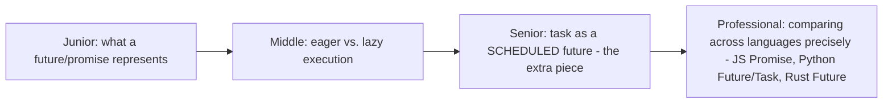
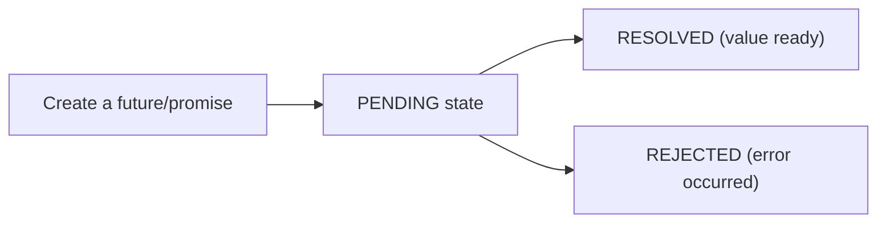

# Futures, Promises, Tasks

> Three overlapping names for "a value that will exist eventually" —
> this page disambiguates the precise, real differences between them
> (eager vs. lazy execution, whether it represents ongoing work or just a
> placeholder) that get blurred by loose, interchangeable terminology
> across languages.

## Choose a level

| Level | Guide | You are done when |
|---|---|---|
| Junior | [What a future represents](junior.md) | You can explain the pending/resolved/rejected states of a future/promise. |
| Middle | [Eager vs. lazy execution](middle.md) | You can explain the difference between a JavaScript Promise (eager) and a Rust Future (lazy). |
| Senior | [Task as a scheduled future](senior.md) | You can explain what a Task adds on top of a plain future/coroutine. |
| Professional | [Comparing across languages](professional.md) | You can precisely compare JS Promises, Python Futures/Tasks, and Rust Futures' execution models. |

## Practice rule

Before assuming "creating a future starts the work," check your specific
language's semantics explicitly — this single assumption differs across
languages (JavaScript: yes, immediately; Rust: no, not until polled) and
getting it wrong is a common cross-language confusion source.

## Related

- [Coroutines & Generators](../coroutines-and-generators/README.md)
- [Async Runtimes](../async-runtimes/README.md)
