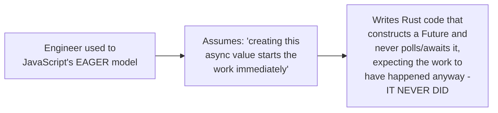

# Futures, Promises, Tasks — Professional

<!-- level-focus -->
At professional level, focus on this question:

> How do JavaScript Promises, Python Futures/Tasks, and Rust Futures
> precisely compare in their execution models, and what cross-language
> migration mistakes does conflating them cause?

Prerequisite: [`senior.md`](senior.md).

---

## The precise comparison table

| Aspect | JavaScript Promise | Python `Future`/`Task` | Rust `Future` |
|---|---|---|---|
| Execution start | Eager — immediately upon creation (`middle.md`) | `Future`: represents already-scheduled work; `Task` (via `create_task`): explicitly, eagerly scheduled | Lazy — nothing runs until polled (`middle.md`) |
| Unused/undriven value | Work still happens (fire-and-forget) | Work still happens if wrapped in a Task | Work never happens at all — a genuinely inert value |
| Concurrency without explicit scheduling | Automatic for multiple in-flight promises (all eager) | Requires explicit `create_task`/`gather` (`senior.md`) | Requires explicit executor spawning (`tokio::spawn`) or `join!` |
| Cancellation | Not natively supported on the Promise itself (needs `AbortController`) | `Task.cancel()` built in | Dropping the future cancels it (its lazy nature makes this natural) |

## The specific cross-language migration bug

This is a well-documented, real cross-language migration pitfall: an
engineer with JavaScript intuition (eager futures) moving to Rust
(lazy futures) can write code that constructs a future for its
side effects, discards it without awaiting, and is surprised the side
effects never occurred — because in Rust's model, an unpolled future is
equivalent to never having called the function at all, a fundamentally
different guarantee than JavaScript's "the promise's work is already
running regardless of what you do with the promise object."

## Why Rust's laziness is actually a deliberate design choice, not an oversight

> 🎯 **Professional-level insight:** Rust's lazy futures aren't a
> limitation — they're what makes **cancellation** trivially safe and
> zero-cost: dropping (discarding) a Rust future simply stops polling it,
> and because nothing was running independently in the background (no
> eagerly-spawned task, no background thread), there's nothing left to
> clean up or synchronize with — cancellation is just "stop asking for
> more progress." JavaScript's eager model, by contrast, needs a
> **separate** cancellation mechanism (`AbortController`) precisely
> because the work is already running independently the moment the
> promise is created, and stopping already-in-flight work requires active
> coordination, not just "stop polling."

## Further Reading

- MDN Web Docs — "Using Promises" (JavaScript's eager execution model,
  explicit).
- Rust async book — "Async/Await" (the lazy futures model and its
  relationship to cancellation).
- Python asyncio documentation — "Tasks and Coroutines" (the
  Future/Task distinction).
- See also: [Cancellation & Timeouts](../cancellation-and-timeouts/README.md).
