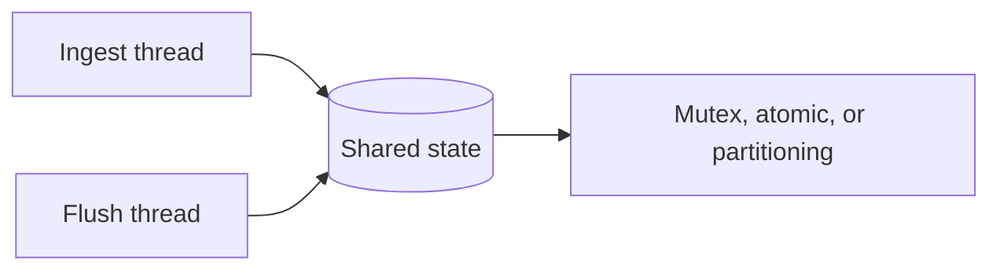

# Shared-Memory Concurrency

> Threads communicate by reading and changing the same memory; synchronization makes those changes safe and visible.

| Level | Guide | You are done when |
|---|---|---|
| Junior | [Start](junior.md) | You can identify shared mutable state. |
| Middle | [Apply](middle.md) | You can establish a happens-before relationship. |
| Senior | [Operate](senior.md) | You can reduce contention without weakening correctness. |
| Professional | [Design](professional.md) | You can justify and verify a concurrency architecture. |

**Practice rule:** First remove sharing; if sharing remains, name its owner and synchronization rule.

## Related

[Mutex](../../02-primitives/01-mutex/README.md) | [Atomics](../../02-primitives/04-atomic/README.md) | [Message passing](../02-message-passing/README.md)
