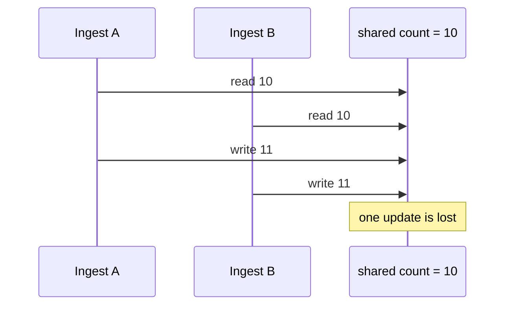

# Shared Memory - Junior

Two threads in one process can access the same object. That is fast, but `counter += 1` is read, change, then write, not one safe action.

In a parallel file loader, this can corrupt counters, buffers, caches, or checkpoint state. The first actionable step is to list every object written by more than one worker. Protect each access with a mutex or give the object one owner; do not assume a thread-safe collection makes compound operations safe.

Continue to [`middle.md`](middle.md).

## Test yourself

1. Why can two increments produce one result?
2. Which state in a parallel ETL worker is shared and mutable?
3. When is one-owner state simpler than a lock?
