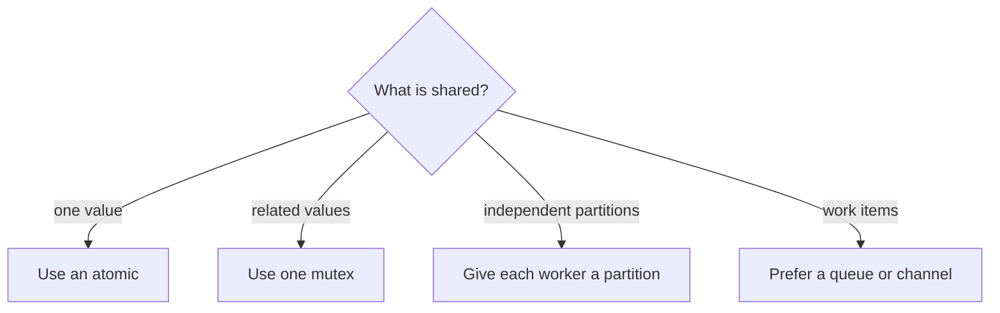

# Shared Memory - Middle

A correct program needs both **atomicity** and **visibility**. A lock release happens-before a later acquisition of the same lock, so protected writes become visible.



For a threaded batch aggregator, keep one lock with the invariant it protects:

```python
from threading import Lock

totals, lock = {}, Lock()
def add(country, amount):
    with lock:
        totals[country] = totals.get(country, 0) + amount
```

Keep I/O and parsing outside the critical section. Document the invariant, such as “`totals` is accessed only while `lock` is held.” Use ThreadSanitizer or the language race detector where available.

Continue to [`senior.md`](senior.md).

## Test yourself

1. What does happens-before add beyond mutual exclusion?
2. Why should warehouse writes stay outside the lock?
3. When would partition-local totals remove the lock?
