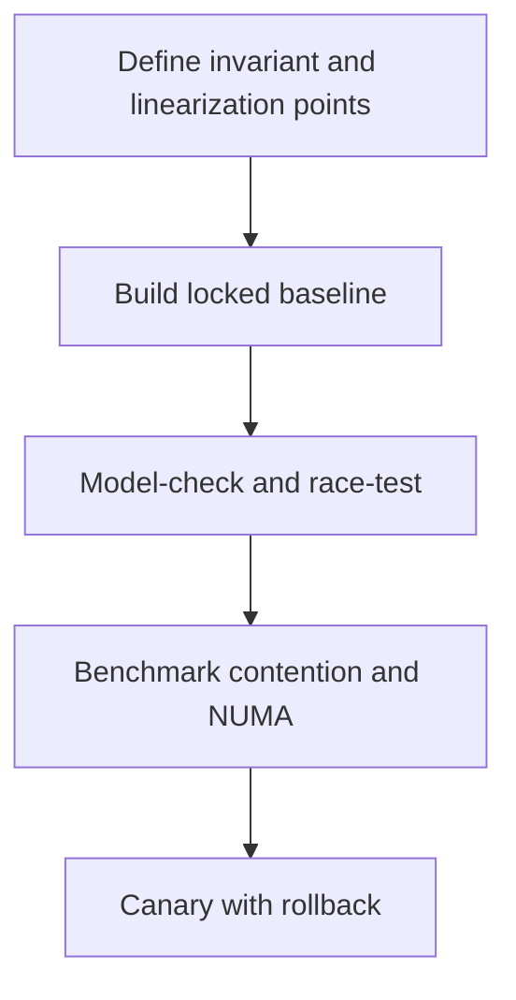

# Shared Memory - Professional

At system level, the choice is not “lock or lock-free.” It is the access pattern, progress guarantee, memory model, reclamation scheme, and operational cost together.



## Real internals

- The Michael-Scott queue CASes `head` and `tail`; unmanaged languages also need hazard pointers or epochs.
- Linux RCU gives near-zero-cost reads, while writers defer reclamation until a grace period ends.
- Java `ConcurrentHashMap` combines CAS and per-bin synchronization; `LongAdder` spreads writes across cells.
- The LMAX Disruptor uses preallocated rings and sequence barriers to avoid allocation and reduce cache misses.

At 10x load, one cache line often saturates before CPU does. At 100x, retry loops, reclamation backlog, and NUMA traffic can dominate. Dashboard lock wait/hold histograms, CAS retries, scheduler parks, queue age, RCU grace-period duration, and memory awaiting reclamation. A runbook should allow traffic reduction, feature rollback, thread-dump capture, and comparison with the locked baseline.

## Design and operations checklist

- State the invariant, linearization point, and progress guarantee.
- Explain every non-default memory ordering.
- Test with TSan, weak-memory simulation, and target hardware.
- Set latency and reclamation limits before rollout.
- Prefer the simplest design that meets measured demand.

```text
partition > immutable snapshot > mutex > specialized lock-free structure
prove correctness -> measure contention -> optimize -> verify again
```

## Further reading

- Michael and Scott, *Simple, Fast, and Practical Non-Blocking and Blocking Concurrent Queue Algorithms*.
- Linux kernel documentation, *What is RCU?*
- Herlihy and Shavit, *The Art of Multiprocessor Programming*.

## Test yourself

1. How would you prove safe reclamation in an MPMC queue?
2. What evidence justifies a lock-free replacement for a mutex?
3. Which signals would reveal a cross-NUMA contention incident?
