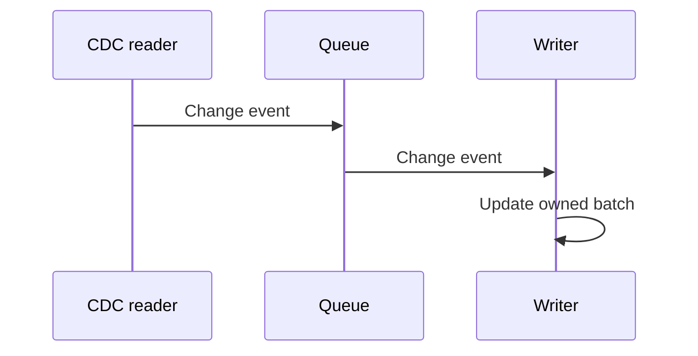

# Message Passing - Junior

A producer sends a value; a consumer owns and processes it. They do not edit one shared object.

This separation simplifies reasoning, but a fast Debezium source can still fill an unbounded queue. Start with an immutable message, a bounded queue, one clear owner after send, and a defined action when full.

Continue to [`middle.md`](middle.md).

## Test yourself

1. How does message passing reduce shared-state races?
2. What happens when the consumer is slower than the producer?
3. Who owns a message after it is sent?
