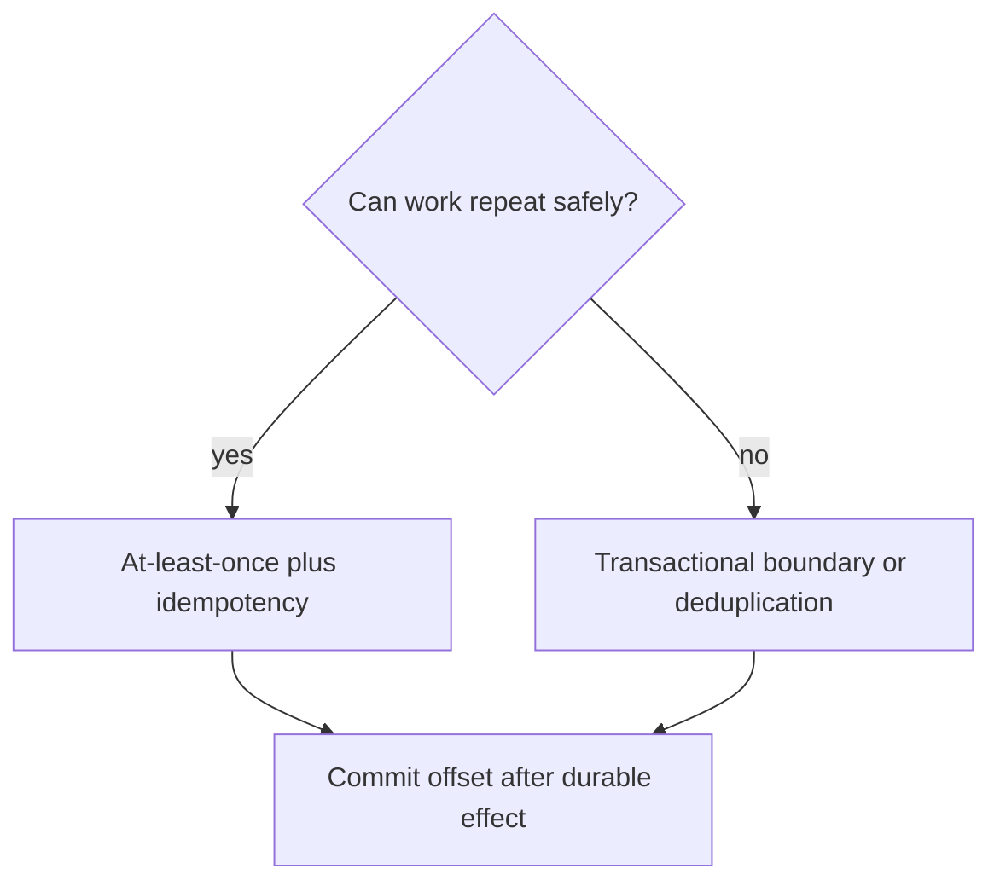

# Message Passing - Middle

Choose semantics before code: ordering scope, delivery guarantee, acknowledgement point, and queue capacity.

For Kafka, key related records by entity to preserve partition order. Store an event ID with the destination write, then commit the offset only after that transaction succeeds. “Exactly once” is always scoped; Kafka transactions do not automatically include an external database.

Track consumer lag, processing rate, retry count, and oldest-message age.

Continue to [`senior.md`](senior.md).

## Test yourself

1. Why is at-least-once practical with idempotent writes?
2. What ordering does a Kafka key provide?
3. Where should acknowledgement happen?
