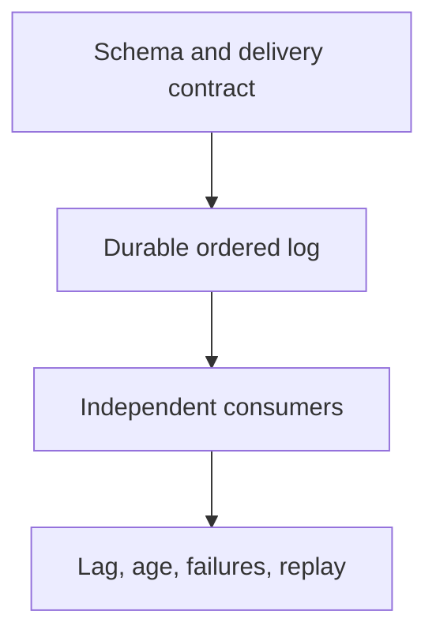

# Message Passing - Professional

Message passing creates a protocol and an operational queue, not automatic isolation from complexity.



## Real internals

- Kafka assigns partition offsets in the leader log; replication and ISR state determine durability.
- Erlang BEAM gives each process a mailbox, but selective receive can scan old messages and grow latency.
- Aeron uses shared-memory term buffers and position counters for low-latency IPC.
- NATS JetStream separates stream retention from consumer acknowledgement state.

At scale, partition skew, mailbox growth, network buffers, and retry amplification fail before average throughput. Dashboard p99 end-to-end age, lag by partition, redelivery rate, queue bytes, replication health, and schema rejection. Runbooks need pause, drain, quarantine, replay, and rollback procedures with audit records.

## Design and operations checklist

- Define identity, ordering scope, delivery, retention, and ownership.
- Bound every queue and retry path.
- Version schemas and rehearse replay from old data.
- Prove idempotency across the actual side-effect boundary.
- Capacity-test skew, not only uniform traffic.

```text
message = identity + schema + ownership + delivery contract
safe replay = retained input + compatible code + idempotent effect
```

## Further reading

- Kleppmann, *Designing Data-Intensive Applications*, streams chapters.
- Kafka protocol and replication design documentation.
- Armstrong, *Making Reliable Distributed Systems in the Presence of Software Errors*.

## Test yourself

1. How would you migrate a hot partition without breaking order?
2. Which contract makes replay safe after a schema change?
3. How would you diagnose rising mailbox scan time?
