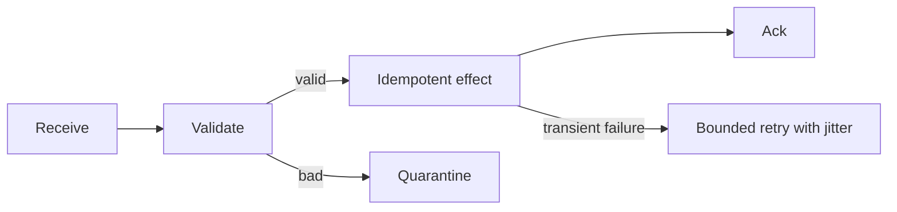

# Message Passing - Senior

Production correctness includes duplicates, loss, reordering, poison messages, backpressure, and partial failure.

| Decision | Safe default |
|---|---|
| Retry | bounded exponential backoff with jitter |
| Poison event | quarantine with reason and replay tool |
| Schema change | backward-compatible reader-first rollout |
| Overload | bounded queues and upstream flow control |
| Cross-service workflow | saga with explicit compensation |

For CDC, preserve source position and transaction identity. Do not let a DLQ silently break entity ordering. Test broker restart, consumer crash after effect but before acknowledgement, and schema rollback.

Continue to [`professional.md`](professional.md).

## Test yourself

1. How do you recover from a crash between effect and acknowledgement?
2. When can a DLQ violate ordering?
3. What limits a retry storm?
