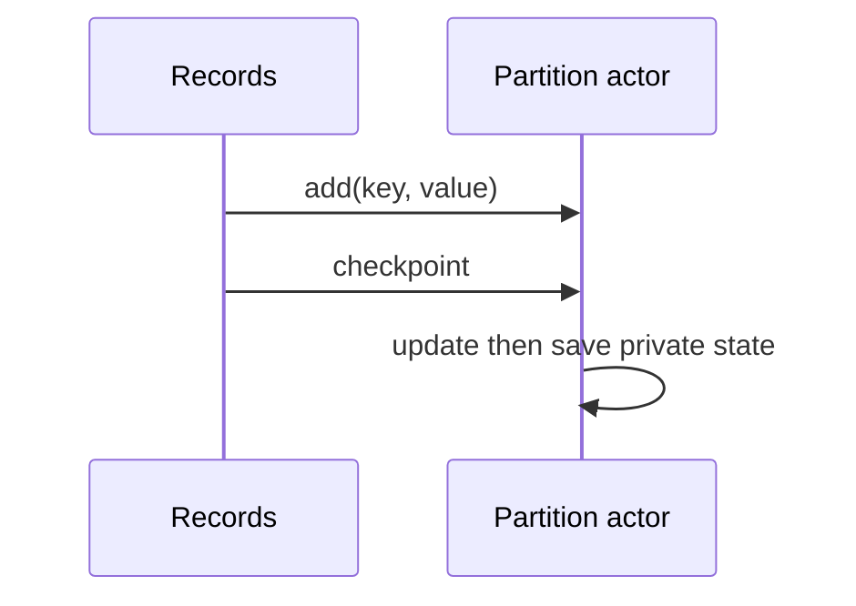

# Actor Model - Junior

An actor is a small worker with private state and a mailbox. It handles one message at a time, so state changes need no internal lock.

In a partitioned stream processor, create one actor per partition or bounded shard, not one per record. Define immutable commands and responses. The naive risk is an unlimited mailbox: isolation prevents races, not out-of-memory failures.

Continue to [`middle.md`](middle.md).

## Test yourself

1. Why does private state usually need no mutex?
2. What is the danger of an unbounded mailbox?
3. What is a sensible actor boundary in a data pipeline?
