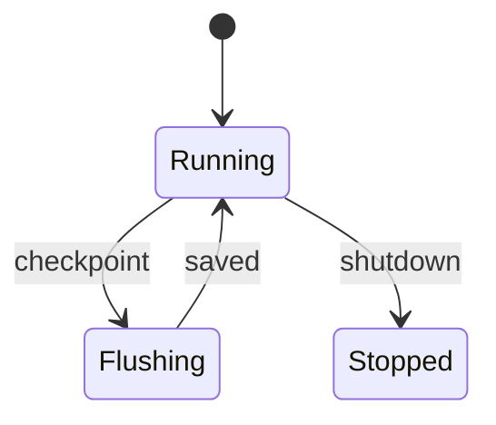

# Actor Model - Middle

Design actors around ownership and lifecycle, then make every message a clear command, query, or event.

For an Akka/Pekko partition actor, persist the source offset with state, reply only after durable save, and use timers rather than blocking the actor thread. Route by stable partition key. Keep messages small and versionable.

Ask: what does this actor own, who may create or stop it, what happens to queued messages on restart, and how is pressure propagated?

Continue to [`senior.md`](senior.md).

## Test yourself

1. Why must an actor avoid blocking I/O on its dispatcher?
2. What should be persisted with checkpoint state?
3. How does a stable routing key preserve locality?
